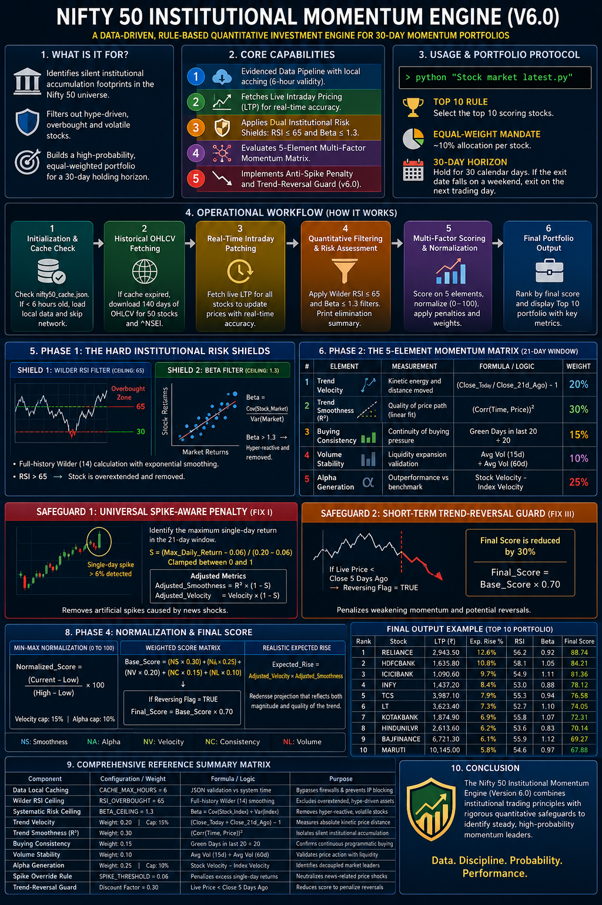

🔴 STANDARD EXPLANATION OF EVERYTHING IN THIS PYTHON PROGRAM.

Complete Comprehensive Analysis of the Institutional Momentum Engine (Version 6.0)
This document provides an exhaustive, deep-dive architectural and mathematical breakdown of the Nifty 50 Institutional Momentum Engine (Version 6.0). It covers the software's structural philosophy, operational data lifecycle, core filtering safeguards, multi-factor scoring matrix, mathematical foundations, and real-world execution protocol.

1. Introduction: What the Program is For

The program is a data-driven, rule-based Quantitative Investment Engine written in Python. Its primary objective is to analyze the top 50 largest stocks in the Indian equity market (the Nifty 50 universe) and construct an optimized, high-probability portfolio designed to be held for a rolling 30-day period.
In the modern financial landscape, retail traders often fall into the trap of emotional investing—buying stocks at the absolute peak of a parabolic curve because of news rumors, social media hype, or a sudden, explosive single-day price surge. This program is built to counter that exact vulnerability. It operates on an Institutional Accumulation Philosophy.

Large institutional market participants—such as Foreign Institutional Investors (FIIs) and Domestic Institutional Investors (DIIs)—do not purchase thousands of crores worth of shares in a single market order. Doing so would cause severe slippage and drive the price against them. Instead, they deploy automated execution algorithms (such as VWAP or TWAP) to quietly absorb liquidity over several weeks. This structural accumulation leaves behind distinct footprints:
A steady, uninterrupted upward trajectory.
An unusually high ratio of positive (green) closing days.

A controlled expansion of daily trading volume.
A distinct insulation from broader market volatility (decoupling).
This script functions as a mathematical filter designed to isolate these silent institutional footprints while systematically disqualifying volatile, news-driven, or overextended stocks.

2. Core Capabilities: What the Program Does
The engine performs five primary automated operations during every execution cycle:
Implements an Evidenced Data Pipeline: Bypasses web scraping blocks using spoofed session headers and builds a local file cache to optimize speed and preserve server bandwidth.
Fetches Live Intraday Pricing: Complements historical trends by pulling the exact real-time equity valuations directly from the market to compute real-time performance metrics.
Applies Dual Institutional Risk Shields: Hard-filters the stock universe, instantly eliminating assets that are mathematically proven to be overbought (hype-driven) or systematically unstable (high beta).Processes a 5-Element Multi-Factor Matrix: Evaluates every surviving stock across five independent statistical dimensions (Smoothness, Alpha, Velocity, Consistency, Volume).
Executes Anti-Spike and Trend-Reversal Protection: Implements rigorous v6.0 mathematical logic to penalize stocks that are rising via erratic, singular price shocks or are actively experiencing a short-term collapse.

3. Usage: Running the System and Managing the Portfolio
The script is entirely self-contained and engineered to run on any standard Python environment without requiring specialized database connections.
Execution Command
The user opens a terminal, command prompt, or standard integrated development environment (IDE) like VS Code or Python IDLE, ensures the dependencies are installed via pip install yfinance numpy requests pandas, and triggers the script:

python "Stock market latest.py"

Portfolio Capital Management Protocol
Once executed, the software generates a clean terminal dashboard containing an actionable 30-day portfolio strategy. The usage rules are strictly defined by quantitative guidelines:
The Top 10 Rule: The engine selects the absolute top 10 scoring assets out of the 50 scanned stocks to populate the final portfolio.
The Equal-Weight Mandate: Capital must be distributed evenly across all ten selections (~10% allocation per stock). This diversification rule protects the total portfolio value if an unforeseen corporate event impacts a single asset.
The 30-Day Holding Horizon: The positions are designed to be entered immediately on the day of execution and liquidated completely exactly 30 calendar days later. If the exit date lands on a weekend, calendar math automatically shifts the liquidation target to the next available market trading session.

4. The Operational Workflow (How It Works)
The internal software architecture processes data linearly through a sequence of steps:

Step 1: Initialization & Local Serialization Check
The program launches, prints its configuration weights, and checks the local hard drive for a file named nifty50_cache.json. It reads the inner timestamp metadata to determine if the local data file is less than 6 hours old. If valid, it completely avoids web requests for historical data, loading the structural data matrix locally in milliseconds.

Step 2: Historical OHLCV Fetching (If Cache is Expired)
If the cache is missing or older than 6 hours, the system connects via a network session to Yahoo Finance. It automatically downloads 140 calendar days of Open, High, Low, Close, and Volume (OHLCV) records for all 50 tickers alongside the benchmark index (^NSEI). This ensures a comfortable buffer of roughly 100 pure market trading sessions.

Step 3: Real-Time Intraday Patching
After securing the historical baseline, the script triggers an independent network routine to bypass the cache and fetch the fresh last-traded price (LTP) for every asset. This ensures that if the script is run mid-session or immediately after market close, the math accounts for live capital changes rather than stale historical data from the previous evening.

Step 4: Quantitative Filtering and Risk Assessment
Every stock is passed through individual sub-routines to calculate its Wilder RSI and date-aligned Beta. The script prints an automated summary to the console detailing exactly how many stocks were eliminated by each structural filter.

Step 5: Multi-Factor Scoring and Normalization
Stocks that cross the risk filters are measured against the five momentum elements. The raw scores are fed into a mathematical normalization function, mapped to a scale of 0 to 100, multiplied by their relative weights, and aggregated into a comprehensive "Probability of Rise" score.

Step 6: Final Portfolio Output
The assets are sorted in descending order based on their weighted scores. The Top 10 assets are displayed on the terminal screen alongside their live prices, expected percentage gains, RSI, Beta metrics, and an automated explanation of their underlying quantitative momentum driver.

5. Phase 1: The Hard Institutional Risk Shields
To preserve capital, the engine acts as an aggressive filter. Before a stock can receive a score, it must cross two mathematical filters.
Shield 1: The Full-History Wilder RSI Filter
The Relative Strength Index (RSI) is a velocity indicator that maps the speed and change of price movements on a scale from 0 to 100. Many retail platforms calculate RSI using a simplified short-term moving average which can lead to data noise. Version 6.0 utilizes J. Welles Wilder’s original 1978 formula, seeded across the entire available historical lookback data array to ensure tight convergence and remove mathematical noise.

Step A: Calculate Daily Price Changes (Deltas)
The engine processes the entire array of daily close prices and determines the change from the prior session:

Delta = Price_Today - Price_Yesterday

If the Delta is positive, it is sorted into a Gain array. If negative, the absolute value is sorted into a Loss array.

Step B: Establish the Initial Seed Values
For the first 14 periods (RSI_PERIOD = 14), the engine calculates a simple mathematical mean of the gains and losses:

Initial_Avg_Gain = Sum(Gains_in_First_14_Days) / 14
Initial_Avg_Loss = Sum(Losses_in_First_14_Days) / 14

Step C: Run the Wilder Exponential Smoothing Loop
For every remaining day in the historical dataset (from day 15 to the final live close), the script applies Wilder's smoothing logic, giving a heavier weight to the previous historical average:

Avg_Gain_Today = (Prev_Avg_Gain * 13 + Current_Gain) / 14
Avg_Loss_Today = (Prev_Avg_Loss * 13 + Current_Loss) / 14

Step D: Calculate Final RSI

Relative_Strength_Value = Avg_Gain_Final / Avg_Loss_Final
RSI = 100 - (100 / (1 + Relative_Strength_Value))

The Hard Threshold: The engine enforces a strict maximum ceiling of 65. If a stock's RSI is greater than 65, it is classified as structurally overextended and completely removed from the universe. This protects the user from chasing assets at the top of a buying exhaustion cycle.

Shield 2: The Date-Aligned Systematic Beta Filter
Beta measures the systematic risk of an individual stock relative to the entire market benchmark index (Nifty 50 Index / ^NSEI). A common programming bug involves calculating beta using mismatched historical data series (e.g., if a stock was suspended for an event, its data array will be shorter than the index). Version 6.0 solves this via an inner database join on shared calendar dates across a stable 90-day window.
The engine extracts the percentage returns of the stock and the market index over identical, overlapping dates and runs a sample covariance calculation:

Stock_Return_Daily = (Stock_Close_Today / Stock_Close_Yesterday) - 1
Market_Return_Daily = (Market_Close_Today / Market_Close_Yesterday) - 1

Beta = Covariance(Stock_Return_Daily, Market_Return_Daily) / Variance(Market_Return_Daily)

The Hard Threshold: The engine applies a structural ceiling of 1.3. If an equity displays a Beta greater than 1.3, it is flagged as hyper-reactive and subject to extreme market swings. The engine drops the stock to ensure the portfolio consists of stable, institutional compounders.

6. Phase 2: The 5-Element Mathematical Engine
Stocks that clear the risk shields are analyzed across five core parameters. Each parameter is calculated over a core evaluation window of 21 trading days (one financial calendar month).
Element 1: Trend Velocity (Weight: 20%)
Velocity measures the pure kinetic energy and directional distance traversed by the asset's price over the monthly cycle.

Raw_Velocity = (Current_Close_Price / Close_Price_21_Days_Ago) - 1

The Mandatory Floor: If a stock's velocity is zero or negative, it is flagged as structurally flat or bearish and dropped immediately. The engine requires positive momentum.

Element 2: Trend Smoothness (R^2 Line Fit) (Weight: 30%)
This is the highest-weighted factor in the system. It does not just look at how much a stock went up; it measures the structural quality of the path taken. It maps out a linear regression model (y = mx + c) where the independent variable (x) is a linear time array from 1 to 21, and the dependent variable (y) is the historical closing price array.
The script computes the Coefficient of Determination (R^2) via the square of the statistical Pearson correlation coefficient:

Smoothness_R2 = [ Correlation_Coefficient(Time_Steps_1_to_21, Closing_Prices_1_to_21) ] * [ Correlation_Coefficient(Time_Steps_1_to_21, Closing_Prices_1_to_21) ]

An R^2 of 1.0 indicates a flawless, straight-line 45-degree diagonal trajectory. This indicates a highly organized, algorithmic institutional buy program.
An R^2 near 0.0 represents a highly erratic asset that may have experienced violent spikes and crashes throughout the month, even if its net velocity ended positive.
Element 3: Buying Consistency (Green Day Ratio) (Weight: 15%)
This metric tracks the continuity of buying pressure over a 20-day trailing window. When institutional accumulation occurs, their algorithms continuously absorb shares day after day, causing the stock to log positive closing prints regardless of the exact size of the daily gain.

Green_Days_Count = Number of sessions where (Close_Today > Close_Yesterday)
Consistency_Ratio = Green_Days_Count / 20

A high consistency ratio validates that the trend is backed by steady accumulation rather than a single sudden trading session.
Element 4: Volume Stability (Weight: 10%)
Price movements on thin volume are considered structurally fragile in quantitative finance. True institutional momentum must be validated by an expansion of liquidity. The engine computes a short-term volume average and measures it against a long-term multi-month volume baseline:

Short_Term_Avg_Volume = Mean of Daily Volumes over the last 15 days
Long_Term_Avg_Volume = Mean of Daily Volumes over the last 60 days

Volume_Ratio = Short_Term_Avg_Volume / Long_Term_Avg_Volume

A ratio greater than 1.0 proves that institutional interest is actively expanding relative to historical norms.
Element 5: Market Leadership (Alpha Generation) (Weight: 25%)
To secure a spot in the institutional portfolio, a stock cannot simply be coasting upward on a general market wave. It must demonstrate unique internal strength by outperforming the benchmark index.

Market_Index_Velocity = (Nifty_Index_Current_Close / Nifty_Index_Close_21_Days_Ago) - 1
Alpha = Raw_Velocity - Market_Index_Velocity

A high Alpha score indicates that the asset has successfully decoupled from the broader market index, demonstrating independent momentum.

7. Phase 3: The Version 6.0 Core Safeguards
Version 6.0 introduces two deep mathematical overrides that dynamically adjust raw calculations based on real-world chart behavior.
The Universal Spike-Aware Penalty Override (Fix I)
If a stock features a single-day movement greater than 6% (SPIKE_THRESHOLD = 0.06), it indicates a chaotic news shock (such as an earnings surprise or speculative rumor) rather than natural, steady growth. Version 6.0 runs a daily return sweep across the 21-day observation window to identify the single largest price shock:

Max_Daily_Return = Maximum absolute percentage move recorded in a single session
Excess_Spike = Max_Daily_Return - 0.06

Spike_Penalty_Factor = Excess_Spike / (0.20 - 0.06)
Spike_Penalty_Factor = Maximum of 0.0 and Minimum of 1.0

How the Penalty Alters the Math
The engine applies this single penalty factor to both Trend Smoothness and Trend Velocity simultaneously, neutralizing speculative assets:

Adjusted_Smoothness = Smoothness_R2 * (1.0 - Spike_Penalty_Factor)
Adjusted_Velocity = Raw_Velocity * (1.0 - Spike_Penalty_Factor)

If an asset gains 20% over the month but achieves that entire gain via an uncontrolled 20% single-day jump, the Spike_Penalty_Factor becomes 1.0. This slashes both its effective smoothness and its effective velocity to exactly zero, removing it from the top rankings.
The Short-Term Trend-Reversal Guard (Fix III)
A mathematical loophole in standard monthly momentum calculations is that a stock can look strong over a 21-day period even if it has spent the last 5 days crashing. The trend-reversal guard acts as an automated safety check on recent sessions.

Reversing_Flag = True if (Current_Live_Price < Close_Price_5_Days_Ago)

If the asset is currently in a short-term downward trend over the last 5 days, the engine flags it as True. While it is not completely disqualified from the scanner, its finalized aggregate score is subjected to an automatic 30% reduction:

Final_Score_Today = Final_Score_Today * (1.0 - 0.30)

This protects the portfolio from buying assets that have peaked and are actively reversing.

8. Phase 4: Normalization and Final Portfolio Allocation
Because the five core elements output entirely different units (Smoothness is an R^2 decimal; Volume is an unconstrained ratio; Alpha is a percentage), they cannot be combined directly. The engine utilizes a Min-Max Normalization Function to convert all values into an identical 0 to 100 relative scale.
The Normalization Scaling Formula
For each element, the engine looks at the minimum value (Low) and maximum value (High) present across the active candidate group and re-scales them:

Normalized_Score = [ (Current_Stock_Value - Group_Low) / (Group_High - Group_Low) ] * 100

This forces every metric into a standardized 0–100 score relative to its peers. To prevent massive outliers from skewing the scaling, Velocity and Alpha are capped at absolute ceilings of 15% and 10% respectively prior to normalization.
The Final Comprehensive Probability Score
The engine executes a weighted matrix multiplication to compute the definitive ranking score:

Base_Score = (Normalized_Smoothness * 0.30) +
             (Normalized_Alpha * 0.25) +
             (Normalized_Velocity * 0.20) +
             (Normalized_Consistency * 0.15) +
             (Normalized_Volume * 0.10)

If Reversing_Flag is active, the engine applies the final discount factor: Final_Score = Base_Score * 0.70.
The Defensive Realism Projection Formula
In the final presentation dashboard, the script avoids simple linear projections. It calculates the Expected Rise % by multiplying the spike-adjusted velocity by its linear trend smoothness:

Expected_Rise = Adjusted_Velocity * Adjusted_Smoothness

This ensures that if an asset displays a solid 12% velocity with near-perfect structural smoothness (R^2 = 0.90), the engine projects a realistic 10.8% continuation trend. If the trend is unstable (R^2 = 0.30), the expected rise is scaled down defensively to 3.6%, protecting the user from unrealistic performance expectations.
9. Comprehensive Reference Summary Matrix

Data Local Caching
Configuration: CACHE_MAX_HOURS = 6
Logic: JSON validation against system modification time.
Purpose: Bypasses network firewalls and prevents IP blocking.

Wilder RSI Ceiling
Configuration: RSI_OVERBOUGHT = 65
Formula/Logic: Full-history Wilder Exponential Smoothing Loop.
Purpose: Excludes overextended, hype-driven assets.

Systematic Risk Ceiling
Configuration: BETA_CEILING = 1.3
Formula/Logic: Beta calculated using aligned 90-day returns:
Beta = Covariance(Stock Returns, Index Returns) ÷ Variance(Index Returns)
Purpose: Removes hyper-reactive, market-volatile stocks.

Trend Velocity Metric
Weight: 0.20
Cap: 0.15
Formula:
(Close_Today ÷ Close_21d_Ago) − 1.0
Purpose: Measures absolute kinetic price distance.

Linear Smoothness
Weight: 0.30
Formula:
Square of Pearson Correlation (R²) over the 21-day trendline.
Purpose: Isolates silent institutional accumulation footprints.

Buying Consistency
Weight: 0.15
Formula:
Count of positive closing sessions during the last 20 trading days.
Purpose: Confirms continuous programmatic buyer support.

Volume Stability
Weight: 0.10
Formula:
Trailing 15-day average volume ÷ 60-day baseline volume.
Purpose: Validates price action with genuine liquidity expansion.

Alpha Generation
Weight: 0.25
Cap: 0.10
Formula:
Stock_Velocity − Benchmark_Index_Velocity
Purpose: Identifies assets that decouple from the broader market index.

Spike Override Rule
Configuration: SPIKE_THRESHOLD = 0.06
Logic:
Deducts excess single-day returns from trend metrics.
Purpose: Neutralizes stocks driven by sharp news-related shocks.

Trend-Reversal Guard
Discount Factor: 0.30
Logic:
Triggered when Live_Price < Close_5_Days_Ago.
Purpose:
Reduces trend score to penalize weakening momentum and potential trend reversals.

10. Conclusion
The Nifty 50 Institutional Momentum Engine (Version 6.0) is a robust, production-ready quantitative screening system. By translating institutional trading patterns into plain-text, actionable calculations, it strips away emotional biases from portfolio construction.
Through its multi-stage framework—incorporating network spoofing, local serialization caching, strict RSI and Beta risk boundaries, spike penalties, and trend-reversal guards—the program ensures that capital is systematically directed toward steady, high-probability, naturally compounding leaders of the Nifty 50 index.

🔴PYTHON OUTPUT EXAMPLE WHEN YOU RUN THE PROGRAM IN IDLE PYTHON:

📈  NIFTY 50 INSTITUTIONAL MOMENTUM ENGINE - NATURAL GROWTH SCANNER
================================================================================
⚙️  ENGINE WEIGHTS: Smoothness (30%) | Alpha (25%) | Velocity (20%) | Consistency (15%) | Volume (10%)

📅  ACTION PLAN
   • BUY  DATE : Monday, June 01, 2026
   • SELL DATE : Wednesday, July 01, 2026  (Holding ~30 Days)
================================================================================

⏳  Step 1/3 — Historical data …

🌐  Fetching historical OHLCV from Yahoo Finance …
HTTP Error 404: {"quoteSummary":{"result":null,"error":{"code":"Not Found","description":"Quote not found for symbol: TATAMOTORS.NS"}}}
$TATAMOTORS.NS: possibly delisted; no timezone found

1 Failed download:
['TATAMOTORS.NS']: possibly delisted; no timezone found
   ✅  49 Nifty50 tickers downloaded on attempt 1
   💾  Cached to nifty50_cache.json

⏳  Step 2/3 — Live prices …
   🔴  Fetching live intraday prices …HTTP Error 404: {"quoteSummary":{"result":null,"error":{"code":"Not Found","description":"Quote not found for symbol: TATAMOTORS.NS"}}}
$TATAMOTORS.NS: possibly delisted; no price data found  (period=1y) (Yahoo error = "No data found, symbol may be delisted")
$TATAMOTORS.NS: possibly delisted; no price data found  (period=5d) (Yahoo error = "No data found, symbol may be delisted")
 done (49/50)

🔬  Step 3/3 — Quantitative engine …

   📊  Filter summary: 3 removed by RSI>65 | 12 removed by Beta>1.3 | 21 removed by negative velocity | 13 passed

🏆  TOP 10 NATURAL GROWTH LEADERS

#1 | HINDALCO
   • Current Price      : ₹1,142.60
   • Expected Rise      : +6.2%  (Spike-Adjusted Velocity × Smoothness)
   • Probability of Rise: 87.9%
   • RSI / Beta         : 62.5  /  0.78
   • Primary Driver     : Strong Alpha decoupling — stock outperforming Nifty 50 index driven by sustained institutional buying pressure.

#2 | CIPLA
   • Current Price      : ₹1,390.00
   • Expected Rise      : +2.6%  (Spike-Adjusted Velocity × Smoothness)
   • Probability of Rise: 61.3%
   • RSI / Beta         : 59.3  /  0.60
   • Primary Driver     : Strong Alpha decoupling — stock outperforming Nifty 50 index driven by sustained institutional buying pressure.

#3 | BAJAJ-AUTO
   • Current Price      : ₹10,356.00
   • Expected Rise      : +2.5%  (Spike-Adjusted Velocity × Smoothness)
   • Probability of Rise: 59.9%
   • RSI / Beta         : 58.6  /  1.02
   • Primary Driver     : Strong Alpha decoupling — stock outperforming Nifty 50 index driven by sustained institutional buying pressure.

#4 | APOLLOHOSP  ⚠️ SHORT-TERM REVERSAL — price falling last 5d
   • Current Price      : ₹8,105.50
   • Expected Rise      : +5.4%  (Spike-Adjusted Velocity × Smoothness)
   • Probability of Rise: 59.1%
   • RSI / Beta         : 58.2  /  0.59
   • Primary Driver     : High Trend Smoothness — clean linear trajectory confirming organic institutional accumulation.

#5 | KOTAKBANK
   • Current Price      : ₹377.10
   • Expected Rise      : +0.1%  (Spike-Adjusted Velocity × Smoothness)
   • Probability of Rise: 36.6%
   • RSI / Beta         : 51.2  /  1.03
   • Primary Driver     : High Trend Smoothness — clean linear trajectory confirming organic institutional accumulation.

#6 | WIPRO
   • Current Price      : ₹206.38
   • Expected Rise      : +0.2%  (Spike-Adjusted Velocity × Smoothness)
   • Probability of Rise: 30.8%
   • RSI / Beta         : 58.1  /  0.53
   • Primary Driver     : Strong Alpha decoupling — stock outperforming Nifty 50 index driven by sustained institutional buying pressure.

#7 | DIVISLAB  ⚠️ SHORT-TERM REVERSAL — price falling last 5d
   • Current Price      : ₹6,556.00
   • Expected Rise      : +0.6%  (Spike-Adjusted Velocity × Smoothness)
   • Probability of Rise: 29.8%
   • RSI / Beta         : 50.4  /  0.58
   • Primary Driver     : High Trend Smoothness — clean linear trajectory confirming organic institutional accumulation.

#8 | JSWSTEEL  ⚠️ SHORT-TERM REVERSAL — price falling last 5d
   • Current Price      : ₹1,299.00
   • Expected Rise      : +0.5%  (Spike-Adjusted Velocity × Smoothness)
   • Probability of Rise: 26.4%
   • RSI / Beta         : 51.6  /  1.19
   • Primary Driver     : High Trend Smoothness — clean linear trajectory confirming organic institutional accumulation.

#9 | TATACONSUM  ⚠️ SHORT-TERM REVERSAL — price falling last 5d
   • Current Price      : ₹1,141.70
   • Expected Rise      : +0.4%  (Spike-Adjusted Velocity × Smoothness)
   • Probability of Rise: 23.1%
   • RSI / Beta         : 50.5  /  0.46
   • Primary Driver     : Strong Alpha decoupling — stock outperforming Nifty 50 index driven by sustained institutional buying pressure.

#10 | TECHM
   • Current Price      : ₹1,542.30
   • Expected Rise      : +0.0%  (Spike-Adjusted Velocity × Smoothness)
   • Probability of Rise: 18.9%
   • RSI / Beta         : 57.9  /  0.49
   • Primary Driver     : Strong Alpha decoupling — stock outperforming Nifty 50 index driven by sustained institutional buying pressure.

--------------------------------------------------------------------------------
⏱️  Executed : 2026-06-01 15:22:11
📂  Cache    : C:\Shoby deathless laptop folder\nifty50_cache.json
⚖️  Allocation: Equal-weight ~10% per position across Top 10
🛡️  Filters  : RSI(Wilder,full-history) < 65 | Beta(90d aligned) < 1.3 | Spike>6% cuts velocity+smoothness | 5d reversal = -30% score
--------------------------------------------------------------------------------

⚠️  DISCLAIMER: Educational & research use only. Not financial advice.

🟪🟪🟪5 YEARS BACKTEST RESULTS FROM 2020 TO 2026

===============================================================================
  NIFTY 50 INSTITUTIONAL MOMENTUM ENGINE — 5-YEAR BACKTEST
  Period : 2020-01-01  →  2026-05-01
  Capital: ₹100,000   |   Top 10 stocks   |   30-day holds
================================================================================

⏳  Step 1/4 — Downloading historical data …

   Downloading 51 tickers from 2019-07-01 …
   (This may take 60–120 seconds on first run)

[                       0%                       ]
[                       0%                       ]
[***                    6%                       ]  3 of 51 completed
[****                   8%                       ]  4 of 51 completed
[*****                 10%                       ]  5 of 51 completed
[*****                 10%                       ]  5 of 51 completed
[*******               14%                       ]  7 of 51 completed
[********              16%                       ]  8 of 51 completed
[*********             18%                       ]  9 of 51 completed
[**********            20%                       ]  10 of 51 completed
[***********           22%                       ]  11 of 51 completed
[************          24%                       ]  12 of 51 completed
[************          25%                       ]  13 of 51 completed
[************          25%                       ]  13 of 51 completed
[**************        29%                       ]  15 of 51 completed
[**************        29%                       ]  15 of 51 completed
[****************      33%                       ]  17 of 51 completed
[*****************     35%                       ]  18 of 51 completed
[******************    37%                       ]  19 of 51 completed
[*******************   39%                       ]  20 of 51 completed
[*******************   39%                       ]  20 of 51 completed
[********************* 43%                       ]  22 of 51 completed
[**********************45%                       ]  23 of 51 completed
[**********************47%                       ]  24 of 51 completed
[**********************49%                       ]  25 of 51 completed
[**********************49%                       ]  25 of 51 completed
[**********************49%                       ]  25 of 51 completed
[**********************55%*                      ]  28 of 51 completed
[**********************57%**                     ]  29 of 51 completed
[**********************59%***                    ]  30 of 51 completed
[**********************61%****                   ]  31 of 51 completed
[**********************63%*****                  ]  32 of 51 completed
[**********************63%*****                  ]  32 of 51 completed
[**********************67%*******                ]  34 of 51 completed
[**********************69%********               ]  35 of 51 completed
[**********************69%********               ]  35 of 51 completed
[**********************69%********               ]  35 of 51 completed
[**********************75%***********            ]  38 of 51 completed
[**********************76%***********            ]  39 of 51 completed
[**********************76%***********            ]  39 of 51 completed
[**********************80%*************          ]  41 of 51 completed
[**********************82%**************         ]  42 of 51 completed
[**********************82%**************         ]  42 of 51 completed
[**********************82%**************         ]  42 of 51 completedHTTP Error 404: {"quoteSummary":{"result":null,"error":{"code":"Not Found","description":"Quote not found for symbol: TATAMOTORS.NS"}}}
$TATAMOTORS.NS: possibly delisted; no timezone found

[**********************88%*****************      ]  45 of 51 completed
[**********************90%******************     ]  46 of 51 completed
[**********************92%*******************    ]  47 of 51 completed
[**********************94%********************   ]  48 of 51 completed
[**********************96%*********************  ]  49 of 51 completed
[**********************98%********************** ]  50 of 51 completed
[*********************100%***********************]  51 of 51 completed

1 Failed download:
['TATAMOTORS.NS']: possibly delisted; no timezone found

   ✅  Loaded 49/50 Nifty stocks + benchmark

⏳  Step 2/4 — Building month calendar …
   Found 75 monthly periods to backtest

⏳  Step 3/4 — Running backtest (75 months) …

   Processing Jan 2020 … [                    ] 1%
   Processing Feb 2020 … [                    ] 3%
   Processing Mar 2020 … [                    ] 4%
   Processing Apr 2020 … [█                   ] 5%
   Processing May 2020 … [█                   ] 7%
   Processing Jun 2020 … [█                   ] 8%
   Processing Jul 2020 … [█                   ] 9%
   Processing Aug 2020 … [██                  ] 11%
   Processing Sep 2020 … [██                  ] 12%
   Processing Oct 2020 … [██                  ] 13%
   Processing Nov 2020 … [██                  ] 15%
   Processing Dec 2020 … [███                 ] 16%
   Processing Jan 2021 … [███                 ] 17%
   Processing Feb 2021 … [███                 ] 19%
   Processing Mar 2021 … [████                ] 20%
   Processing Apr 2021 … [████                ] 21%
   Processing May 2021 … [████                ] 23%
   Processing Jun 2021 … [████                ] 24%
   Processing Jul 2021 … [█████               ] 25%
   Processing Aug 2021 … [█████               ] 27%
   Processing Sep 2021 … [█████               ] 28%
   Processing Oct 2021 … [█████               ] 29%
   Processing Nov 2021 … [██████              ] 31%
   Processing Dec 2021 … [██████              ] 32%
   Processing Jan 2022 … [██████              ] 33%
   Processing Feb 2022 … [██████              ] 35%
   Processing Mar 2022 … [███████             ] 36%
   Processing Apr 2022 … [███████             ] 37%
   Processing May 2022 … [███████             ] 39%
   Processing Jun 2022 … [████████            ] 40%
   Processing Jul 2022 … [████████            ] 41%
   Processing Aug 2022 … [████████            ] 43%
   Processing Sep 2022 … [████████            ] 44%
   Processing Oct 2022 … [█████████           ] 45%
   Processing Nov 2022 … [█████████           ] 47%
   Processing Dec 2022 … [█████████           ] 48%
   Processing Jan 2023 … [█████████           ] 49%
   Processing Feb 2023 … [██████████          ] 51%
   Processing Mar 2023 … [██████████          ] 52%
   Processing Apr 2023 … [██████████          ] 53%
   Processing May 2023 … [██████████          ] 55%
   Processing Jun 2023 … [███████████         ] 56%
   Processing Jul 2023 … [███████████         ] 57%
   Processing Aug 2023 … [███████████         ] 59%
   Processing Sep 2023 … [████████████        ] 60%
   Processing Oct 2023 … [████████████        ] 61%
   Processing Nov 2023 … [████████████        ] 63%
   Processing Dec 2023 … [████████████        ] 64%
   Processing Jan 2024 … [█████████████       ] 65%
   Processing Feb 2024 … [█████████████       ] 67%
   Processing Mar 2024 … [█████████████       ] 68%
   Processing Apr 2024 … [█████████████       ] 69%
   Processing May 2024 … [██████████████      ] 71%
   Processing Jun 2024 … [██████████████      ] 72%
   Processing Jul 2024 … [██████████████      ] 73%
   Processing Aug 2024 … [██████████████      ] 75%
   Processing Sep 2024 … [███████████████     ] 76%
   Processing Oct 2024 … [███████████████     ] 77%
   Processing Nov 2024 … [███████████████     ] 79%
   Processing Dec 2024 … [████████████████    ] 80%
   Processing Jan 2025 … [████████████████    ] 81%
   Processing Feb 2025 … [████████████████    ] 83%
   Processing Mar 2025 … [████████████████    ] 84%
   Processing Apr 2025 … [█████████████████   ] 85%
   Processing May 2025 … [█████████████████   ] 87%
   Processing Jun 2025 … [█████████████████   ] 88%
   Processing Jul 2025 … [█████████████████   ] 89%
   Processing Aug 2025 … [██████████████████  ] 91%
   Processing Sep 2025 … [██████████████████  ] 92%
   Processing Oct 2025 … [██████████████████  ] 93%
   Processing Nov 2025 … [██████████████████  ] 95%
   Processing Dec 2025 … [███████████████████ ] 96%
   Processing Jan 2026 … [███████████████████ ] 97%
   Processing Feb 2026 … [███████████████████ ] 99%
   Processing Mar 2026 … [████████████████████] 100%
   ✅  Backtest complete — 75 months simulated

⏳  Step 4/4 — Computing statistics and printing results …

================================================================================
  NIFTY 50 MOMENTUM ENGINE — 5-YEAR BACKTEST RESULTS
================================================================================

📋  MONTH-BY-MONTH TRADE LOG

  Month        Stocks Selected                                        Return       Capital
  ────────────────────────────────────────────────────────────────────────────────
  Jan 2020     INFY  HDFCLIFE  HINDALCO  TCS  NESTLEIND  ASIANP...    -0.59%  ₹     99,413
  Feb 2020     BAJFINANCE  BHARTIARTL  TATACONSUM  GRASIM  TITA...    -2.81%  ₹     96,615
  Mar 2020     DIVISLAB  HINDUNILVR  APOLLOHOSP  BHARTIARTL  NE...   -15.56%  ₹     81,578
  Apr 2020     CIPLA  DRREDDY  HINDUNILVR                            +23.57%  ₹    100,802
  May 2020     TATACONSUM  BRITANNIA  APOLLOHOSP  HEROMOTOCO  H...   +10.44%  ₹    111,328
  Jun 2020     ADANIPORTS  HEROMOTOCO  ULTRACEMCO  JSWSTEEL  BA...    +4.41%  ₹    116,234
  Jul 2020     HDFCLIFE  BPCL  ADANIENT  VEDL  TATACONSUM  SBIN...   +11.40%  ₹    129,490
  Aug 2020     APOLLOHOSP  M&M  EICHERMOT  RELIANCE  SUNPHARMA ...   +10.52%  ₹    143,118
  Sep 2020     HEROMOTOCO  ADANIPORTS  GRASIM  NTPC  MARUTI  TE...    -0.74%  ₹    142,064
  Oct 2020     INFY  DRREDDY  TCS  HCLTECH  HEROMOTOCO  GRASIM ...    -4.38%  ₹    135,842
  Nov 2020     ULTRACEMCO  JSWSTEEL  HDFCBANK  ASIANPAINT  TATA...   +16.27%  ₹    157,946
  Dec 2020     EICHERMOT  SUNPHARMA  TATACONSUM  TITAN  SBILIFE...    +5.78%  ₹    167,067
  Jan 2021     DRREDDY  TCS  HINDUNILVR  ONGC  ITC  SBILIFE  DI...    -2.00%  ₹    163,728
  Feb 2021     BHARTIARTL  APOLLOHOSP  ADANIPORTS  ADANIENT  EI...   +12.62%  ₹    184,387
  Mar 2021     POWERGRID  TATASTEEL  RELIANCE  APOLLOHOSP  TATA...    +0.36%  ₹    185,057
  Apr 2021     HINDUNILVR  SHRIRAMFIN  TCS  INFY  ASIANPAINT  T...    -5.29%  ₹    175,270
  May 2021     CIPLA  APOLLOHOSP  SBILIFE  TATACONSUM  BHARTIAR...    +4.18%  ₹    182,595
  Jun 2021     LT  EICHERMOT  MARUTI  NESTLEIND  COALINDIA  TIT...    +1.58%  ₹    185,489
  Jul 2021     TECHM  TCS  TITAN  HINDUNILVR  HCLTECH  GRASIM  ...    +2.53%  ₹    190,178
  Aug 2021     BHARTIARTL  GRASIM  NESTLEIND  ITC  TATACONSUM  ...    +6.64%  ₹    202,814
  Sep 2021     ADANIENT  ADANIPORTS  BPCL  DRREDDY  EICHERMOT  ...    +6.31%  ₹    215,620
  Oct 2021     KOTAKBANK  MARUTI  HCLTECH  HEROMOTOCO  BAJAJ-AU...    -2.11%  ₹    211,065
  Nov 2021     TECHM  SHRIRAMFIN  LT  DIVISLAB  M&M  MARUTI  KO...    -1.83%  ₹    207,198
  Dec 2021     TECHM  TCS  BHARTIARTL  CIPLA  HCLTECH  NESTLEIN...    +4.18%  ₹    215,862
  Jan 2022     DRREDDY  LT  ICICIBANK  ULTRACEMCO  SBILIFE  CIP...    +2.71%  ₹    221,707
  Feb 2022     MARUTI  HEROMOTOCO  SBIN  BAJAJ-AUTO  COALINDIA ...    -7.54%  ₹    204,985
  Mar 2022     VEDL  TITAN  APOLLOHOSP  ITC  INDUSINDBK  DIVISL...    +5.61%  ₹    216,482
  Apr 2022     INFY  BAJAJ-AUTO  SUNPHARMA  HDFCBANK  DRREDDY  ...    -3.10%  ₹    209,766
  May 2022     NTPC  HINDUNILVR  HEROMOTOCO  NESTLEIND  ADANIPO...    -1.75%  ₹    206,094
  Jun 2022     BRITANNIA  EICHERMOT  SBILIFE  ITC  MARUTI  DRRE...    -0.58%  ₹    204,896
  Jul 2022     HEROMOTOCO  DIVISLAB  APOLLOHOSP  EICHERMOT  DRR...    +8.20%  ₹    221,700
  Aug 2022     TATACONSUM  HINDUNILVR  EICHERMOT  KOTAKBANK  CI...    +1.90%  ₹    225,911
  Sep 2022     EICHERMOT  ICICIBANK  LT  BHARTIARTL  ITC  BAJAJ...    -3.18%  ₹    218,727
  Oct 2022     DIVISLAB  BRITANNIA  EICHERMOT  HINDUNILVR  APOL...    +3.98%  ₹    227,424
  Nov 2022     SBIN  AXISBANK  RELIANCE  KOTAKBANK  BAJAJ-AUTO ...    +1.25%  ₹    230,262
  Dec 2022     ICICIBANK  TATACONSUM  APOLLOHOSP  ADANIPORTS  A...    -2.18%  ₹    225,246
  Jan 2023     SHRIRAMFIN  AXISBANK  SBIN  INDUSINDBK  LT  HDFC...    -6.77%  ₹    210,002
  Feb 2023     M&M  BAJAJ-AUTO  MARUTI  TCS  WIPRO  DRREDDY  UL...    -2.04%  ₹    205,721
  Mar 2023     TECHM  NTPC  POWERGRID  ITC  ASIANPAINT  ULTRACE...    -0.35%  ₹    204,998
  Apr 2023     SHRIRAMFIN  HINDUNILVR  NTPC  BPCL  SUNPHARMA  G...    +4.17%  ₹    213,546
  May 2023     M&M  HDFCLIFE  TATASTEEL  SHRIRAMFIN  WIPRO  HER...    +5.20%  ₹    224,652
  Jun 2023     HDFCLIFE  TECHM  BHARTIARTL  VEDL  SHRIRAMFIN  M...    +6.44%  ₹    239,115
  Jul 2023     TATACONSUM  BRITANNIA  POWERGRID  ONGC  AXISBANK...    +2.10%  ₹    244,130
  Aug 2023     SBIN  TCS  GRASIM  BAJAJ-AUTO  HEROMOTOCO  JSWST...    -3.57%  ₹    235,423
  Sep 2023     M&M  AXISBANK  SHRIRAMFIN  HCLTECH  LT  POWERGRI...    +2.36%  ₹    240,985
  Oct 2023     BAJAJ-AUTO  POWERGRID  BHARTIARTL  NTPC  SBIN  A...    -0.80%  ₹    239,048
  Nov 2023     NESTLEIND  BAJAJ-AUTO  SBILIFE  HCLTECH  TATACON...    +9.17%  ₹    260,961
  Dec 2023     M&M  SBILIFE  ASIANPAINT  MARUTI  VEDL  INFY  ON...    +8.25%  ₹    282,489
  Jan 2024     BPCL  GRASIM  ONGC  CIPLA  INFY  AXISBANK  APOLL...    +6.44%  ₹    300,684
  Feb 2024     HCLTECH  ICICIBANK  CIPLA  INFY  TCS  TECHM  VED...    +4.50%  ₹    314,213
  Mar 2024     POWERGRID  BPCL  NESTLEIND  SBILIFE  CIPLA  COAL...    -0.43%  ₹    312,854
  Apr 2024     HINDALCO  HDFCLIFE  KOTAKBANK  BHARTIARTL  ITC  ...    +1.39%  ₹    317,203
  May 2024     SHRIRAMFIN  BHARTIARTL  ICICIBANK  HDFCBANK  ULT...    +0.03%  ₹    317,300
  Jun 2024     KOTAKBANK  BRITANNIA  HINDUNILVR  CIPLA  BAJAJ-A...    +5.29%  ₹    334,093
  Jul 2024     HDFCLIFE  SBILIFE  M&M  KOTAKBANK  BAJFINANCE  A...    +4.07%  ₹    347,694
  Aug 2024     EICHERMOT  BHARTIARTL  TATACONSUM  BRITANNIA  BA...    +4.85%  ₹    364,548
  Sep 2024     HEROMOTOCO  TCS  BRITANNIA  ICICIBANK  WIPRO  IT...    +0.91%  ₹    367,883
  Oct 2024     NESTLEIND  DIVISLAB  BAJAJ-AUTO  BHARTIARTL  APO...    -6.66%  ₹    343,378
  Nov 2024     DIVISLAB  ICICIBANK  EICHERMOT  SBIN  HDFCBANK  ...    +1.11%  ₹    347,179
  Dec 2024     TECHM  CIPLA  HDFCBANK  WIPRO  INFY  TCS  POWERG...    -1.97%  ₹    340,332
  Jan 2025     APOLLOHOSP  BAJFINANCE  ITC  KOTAKBANK  WIPRO  C...    -0.14%  ₹    339,868
  Feb 2025     WIPRO  BAJAJFINSV  JSWSTEEL  KOTAKBANK  BHARTIAR...    -3.96%  ₹    326,424
  Mar 2025     HINDALCO  BAJAJFINSV  TATASTEEL  JSWSTEEL  KOTAK...    +7.79%  ₹    351,845
  Apr 2025     ULTRACEMCO  POWERGRID  APOLLOHOSP  BHARTIARTL  I...    +1.99%  ₹    358,852
  May 2025     INDUSINDBK  TITAN  HDFCBANK  M&M  BHARTIARTL  BR...    +0.26%  ₹    359,802
  Jun 2025     HEROMOTOCO  BAJAJ-AUTO  BRITANNIA  DIVISLAB  SBI...    +1.78%  ₹    366,224
  Jul 2025     TECHM  WIPRO  M&M  KOTAKBANK  BPCL  CIPLA  INFY ...    -3.12%  ₹    354,784
  Aug 2025     ICICIBANK  HDFCBANK  BRITANNIA  HEROMOTOCO  ITC ...    +2.91%  ₹    365,126
  Sep 2025     HINDUNILVR  ASIANPAINT  TITAN  HINDALCO  ULTRACE...    -2.66%  ₹    355,410
  Oct 2025     AXISBANK  SBIN  TATACONSUM  SUNPHARMA  NTPC  LT ...    +3.71%  ₹    368,608
  Nov 2025     BHARTIARTL  INDUSINDBK  TITAN  SUNPHARMA  ASIANP...    +2.10%  ₹    376,364
  Dec 2025     DRREDDY  SBIN  TITAN  WIPRO  AXISBANK  BAJAJ-AUT...    +1.26%  ₹    381,112
  Jan 2026     BPCL  GRASIM  MARUTI  WIPRO  EICHERMOT  TECHM  U...    -2.89%  ₹    370,117
  Feb 2026     TECHM  ONGC  ULTRACEMCO  VEDL  SBIN  HCLTECH  NT...    -0.08%  ₹    369,828
  Mar 2026     SUNPHARMA  NTPC  DIVISLAB  SBIN  EICHERMOT  TITA...   -10.40%  ₹    331,353

================================================================================
  DETAILED TRADE BREAKDOWN — ALL MONTHS
================================================================================

  📅  01 Jan 2020  →  31 Jan 2020   |  Portfolio return: -0.59%
  Ticker              Buy ₹      Sell ₹    Return       P&L ₹
  ────────────────────────────────────────────────────────────
  ✅ INFY             633.15      666.75    +5.31%         531
  ❌ HDFCLIFE         612.08      590.17    -3.58%        -358
  ❌ HINDALCO         205.76      181.80   -11.64%      -1,164
  ❌ TCS            1,841.15    1,769.95    -3.87%        -387
  ✅ NESTLEIND        690.58      717.70    +3.93%         393
  ✅ ASIANPAINT     1,705.42    1,707.75    +0.14%          14
  ❌ WIPRO            113.71      109.14    -4.01%        -401
  ❌ COALINDIA        116.76      100.10   -14.27%      -1,427
  ✅ TATACONSUM       306.71      363.11   +18.39%       1,839
  ✅ HCLTECH          450.69      467.58    +3.75%         375

  📅  03 Feb 2020  →  04 Mar 2020   |  Portfolio return: -2.81%
  Ticker              Buy ₹      Sell ₹    Return       P&L ₹
  ────────────────────────────────────────────────────────────
  ❌ BAJFINANCE       426.05      419.88    -1.45%        -160
  ✅ BHARTIARTL       487.56      493.97    +1.31%         145
  ❌ TATACONSUM       358.80      330.72    -7.83%        -864
  ❌ GRASIM           753.48      665.72   -11.65%      -1,287
  ✅ TITAN          1,163.75    1,227.07    +5.44%         601
  ❌ TECHM            627.17      618.20    -1.43%        -158
  ❌ ULTRACEMCO     4,239.22    4,047.32    -4.53%        -500
  ❌ INFY             659.40      651.97    -1.13%        -125
  ❌ KOTAKBANK        333.86      320.25    -4.07%        -450

  📅  02 Mar 2020  →  01 Apr 2020   |  Portfolio return: -15.56%
  Ticker              Buy ₹      Sell ₹    Return       P&L ₹
  ────────────────────────────────────────────────────────────
  ❌ DIVISLAB       2,046.05    1,820.76   -11.01%      -1,773
  ✅ HINDUNILVR     1,951.35    1,969.60    +0.94%         151
  ❌ APOLLOHOSP     1,703.46    1,073.05   -37.01%      -5,959
  ❌ BHARTIARTL       495.50      402.77   -18.71%      -3,013
  ❌ NESTLEIND        752.77      731.49    -2.83%        -455
  ❌ TITAN          1,220.40      918.18   -24.76%      -3,988

  📅  01 Apr 2020  →  04 May 2020   |  Portfolio return: +23.57%
  Ticker              Buy ₹      Sell ₹    Return       P&L ₹
  ────────────────────────────────────────────────────────────
  ✅ CIPLA            398.52      589.33   +47.88%      13,020
  ✅ DRREDDY          596.01      758.54   +27.27%       7,415
  ❌ HINDUNILVR     1,969.60    1,881.95    -4.45%      -1,210

  📅  04 May 2020  →  03 Jun 2020   |  Portfolio return: +10.44%
  Ticker              Buy ₹      Sell ₹    Return       P&L ₹
  ────────────────────────────────────────────────────────────
  ✅ TATACONSUM       317.23      347.25    +9.46%         954
  ✅ BRITANNIA      2,793.86    3,170.85   +13.49%       1,360
  ❌ APOLLOHOSP     1,351.84    1,330.21    -1.60%        -161
  ✅ HEROMOTOCO     1,636.37    1,881.33   +14.97%       1,509
  ✅ HCLTECH          406.58      444.97    +9.44%         952
  ✅ BHARTIARTL       509.02      527.33    +3.60%         363
  ✅ SUNPHARMA        438.34      448.42    +2.30%         232
  ✅ DIVISLAB       2,218.62    2,310.82    +4.16%         419
  ✅ ONGC              55.08       62.10   +12.74%       1,284
  ✅ M&M              339.17      460.81   +35.86%       3,615

  📅  01 Jun 2020  →  01 Jul 2020   |  Portfolio return: +4.41%
  Ticker              Buy ₹      Sell ₹    Return       P&L ₹
  ────────────────────────────────────────────────────────────
  ✅ ADANIPORTS       319.71      333.73    +4.39%         488
  ✅ HEROMOTOCO     1,902.68    2,083.56    +9.51%       1,058
  ✅ ULTRACEMCO     3,700.96    3,781.37    +2.17%         242
  ❌ JSWSTEEL         181.67      179.33    -1.29%        -144
  ✅ BAJAJ-AUTO     2,378.61    2,450.83    +3.04%         338
  ✅ ADANIENT         150.14      157.27    +4.75%         529
  ✅ VEDL              40.74       46.85   +15.00%       1,670
  ❌ ONGC              60.41       57.89    -4.17%        -464
  ✅ TATACONSUM       343.65      366.80    +6.74%         750
  ✅ SBILIFE          765.46      795.55    +3.93%         438

  📅  01 Jul 2020  →  31 Jul 2020   |  Portfolio return: +11.40%
  Ticker              Buy ₹      Sell ₹    Return       P&L ₹
  ────────────────────────────────────────────────────────────
  ✅ HDFCLIFE         541.36      617.65   +14.09%       1,638
  ✅ BPCL             128.57      139.95    +8.85%       1,029
  ✅ ADANIENT         157.27      174.83   +11.16%       1,298
  ✅ VEDL              46.85       49.50    +5.66%         658
  ✅ TATACONSUM       366.80      408.35   +11.33%       1,317
  ✅ SBIN             167.50      173.53    +3.60%         418
  ✅ M&M              473.96      578.55   +22.07%       2,565
  ✅ HINDUNILVR     1,974.63    2,019.17    +2.26%         262
  ✅ INFY             637.46      841.35   +31.99%       3,718
  ✅ GRASIM           593.16      611.21    +3.04%         354

  📅  03 Aug 2020  →  02 Sep 2020   |  Portfolio return: +10.52%
  Ticker              Buy ₹      Sell ₹    Return       P&L ₹
  ────────────────────────────────────────────────────────────
  ✅ APOLLOHOSP     1,551.50    1,674.00    +7.90%       1,022
  ✅ M&M              569.68      613.18    +7.64%         989
  ✅ EICHERMOT      1,981.37    2,068.74    +4.41%         571
  ✅ RELIANCE         910.94      964.99    +5.93%         768
  ❌ SUNPHARMA        489.15      485.46    -0.75%         -98
  ✅ VEDL              50.16       57.03   +13.70%       1,774
  ✅ ADANIENT         171.83      292.34   +70.13%       9,081
  ❌ HDFCLIFE         593.91      572.09    -3.67%        -476
  ❌ SBILIFE          864.55      840.05    -2.83%        -367
  ✅ BRITANNIA      3,411.03    3,506.50    +2.80%         362

  📅  01 Sep 2020  →  01 Oct 2020   |  Portfolio return: -0.74%
  Ticker              Buy ₹      Sell ₹    Return       P&L ₹
  ────────────────────────────────────────────────────────────
  ✅ HEROMOTOCO     2,472.33    2,600.96    +5.20%         745
  ✅ ADANIPORTS       338.59      342.95    +1.29%         185
  ✅ GRASIM           664.88      732.87   +10.23%       1,463
  ❌ NTPC              80.68       68.64   -14.93%      -2,137
  ❌ MARUTI         6,618.64    6,513.83    -1.58%        -227
  ✅ TECHM            588.13      664.61   +13.00%       1,861
  ❌ BHARTIARTL       524.04      414.77   -20.85%      -2,984
  ❌ COALINDIA         80.15       70.42   -12.14%      -1,737
  ❌ ONGC              57.10       49.76   -12.85%      -1,840
  ✅ APOLLOHOSP     1,646.60    2,062.78   +25.28%       3,617

  📅  01 Oct 2020  →  02 Nov 2020   |  Portfolio return: -4.38%
  Ticker              Buy ₹      Sell ₹    Return       P&L ₹
  ────────────────────────────────────────────────────────────
  ✅ INFY             886.34      943.97    +6.50%         924
  ❌ DRREDDY          990.77      941.66    -4.96%        -704
  ✅ TCS            2,175.20    2,254.72    +3.66%         519
  ✅ HCLTECH          646.52      657.06    +1.63%         231
  ❌ HEROMOTOCO     2,600.96    2,340.32   -10.02%      -1,424
  ✅ GRASIM           732.87      765.22    +4.41%         627
  ❌ VEDL              59.79       45.40   -24.06%      -3,419
  ❌ CIPLA            744.55      723.60    -2.81%        -400
  ❌ TITAN          1,180.29    1,150.60    -2.52%        -357
  ❌ RELIANCE       1,009.00      851.29   -15.63%      -2,220

  📅  02 Nov 2020  →  02 Dec 2020   |  Portfolio return: +16.27%
  Ticker              Buy ₹      Sell ₹    Return       P&L ₹
  ────────────────────────────────────────────────────────────
  ✅ ULTRACEMCO     4,427.87    4,799.85    +8.40%       1,141
  ✅ JSWSTEEL         292.84      348.73   +19.09%       2,593
  ✅ HDFCBANK         575.53      666.31   +15.77%       2,143
  ✅ ASIANPAINT     2,079.79    2,216.67    +6.58%         894
  ✅ TATASTEEL         34.68       52.03   +50.02%       6,795
  ✅ POWERGRID         71.99       80.77   +12.19%       1,656
  ✅ BHARTIARTL       438.81      465.19    +6.01%         817
  ✅ GRASIM           765.22      889.20   +16.20%       2,201
  ✅ NTPC              72.11       76.64    +6.28%         853
  ✅ LT               856.74    1,046.66   +22.17%       3,011

  📅  01 Dec 2020  →  31 Dec 2020   |  Portfolio return: +5.78%
  Ticker              Buy ₹      Sell ₹    Return       P&L ₹
  ────────────────────────────────────────────────────────────
  ❌ EICHERMOT      2,414.68    2,412.96    -0.07%         -11
  ✅ SUNPHARMA        508.90      558.91    +9.83%       1,552
  ✅ TATACONSUM       504.94      562.75   +11.45%       1,808
  ✅ TITAN          1,320.56    1,543.15   +16.86%       2,662
  ✅ SBILIFE          841.09      893.35    +6.21%         981
  ✅ NTPC              75.79       80.32    +5.97%         943
  ❌ HEROMOTOCO     2,566.95    2,566.75    -0.01%          -1
  ✅ ULTRACEMCO     4,777.86    5,145.31    +7.69%       1,215
  ❌ BRITANNIA      3,349.73    3,300.82    -1.46%        -231
  ✅ POWERGRID         80.02       81.04    +1.28%         202

  📅  01 Jan 2021  →  01 Feb 2021   |  Portfolio return: -2.00%
  Ticker              Buy ₹      Sell ₹    Return       P&L ₹
  ────────────────────────────────────────────────────────────
  ❌ DRREDDY        1,015.83      858.23   -15.52%      -2,592
  ✅ TCS            2,534.90    2,722.81    +7.41%       1,238
  ❌ HINDUNILVR     2,195.60    2,067.82    -5.82%        -972
  ❌ ONGC              67.06       65.37    -2.52%        -421
  ✅ ITC              159.72      161.29    +0.98%         164
  ❌ SBILIFE          884.61      863.96    -2.33%        -390
  ❌ DIVISLAB       3,733.72    3,359.82   -10.01%      -1,673
  ✅ ULTRACEMCO     5,147.88    5,588.99    +8.57%       1,432
  ✅ HDFCLIFE         668.17      688.51    +3.04%         509
  ❌ MARUTI         7,371.63    7,092.25    -3.79%        -633

  📅  01 Feb 2021  →  03 Mar 2021   |  Portfolio return: +12.62%
  Ticker              Buy ₹      Sell ₹    Return       P&L ₹
  ────────────────────────────────────────────────────────────
  ❌ BHARTIARTL       555.61      524.09    -5.67%        -929
  ✅ APOLLOHOSP     2,629.12    3,017.55   +14.77%       2,419
  ✅ ADANIPORTS       526.86      708.48   +34.47%       5,644
  ✅ ADANIENT         535.90      913.13   +70.39%      11,525
  ❌ EICHERMOT      2,710.38    2,477.94    -8.58%      -1,404
  ✅ HEROMOTOCO     2,757.11    2,883.60    +4.59%         751
  ✅ SHRIRAMFIN       243.22      248.72    +2.26%         371
  ✅ ULTRACEMCO     5,588.99    6,324.91   +13.17%       2,156
  ❌ TCS            2,722.81    2,653.21    -2.56%        -419
  ✅ WIPRO            194.71      201.18    +3.32%         544

  📅  01 Mar 2021  →  31 Mar 2021   |  Portfolio return: +0.36%
  Ticker              Buy ₹      Sell ₹    Return       P&L ₹
  ────────────────────────────────────────────────────────────
  ❌ POWERGRID         97.01       93.76    -3.35%        -618
  ✅ TATASTEEL         62.88       69.89   +11.15%       2,056
  ❌ RELIANCE         952.98      908.27    -4.69%        -865
  ❌ APOLLOHOSP     3,041.38    2,865.19    -5.79%      -1,068
  ✅ TATACONSUM       595.80      609.49    +2.30%         424
  ✅ ULTRACEMCO     6,193.12    6,555.94    +5.86%       1,080
  ❌ HDFCBANK         738.28      707.37    -4.19%        -772
  ❌ HDFCLIFE         694.62      685.70    -1.28%        -237
  ✅ TITAN          1,429.91    1,534.19    +7.29%       1,345
  ❌ LT             1,384.13    1,333.43    -3.66%        -675

  📅  01 Apr 2021  →  03 May 2021   |  Portfolio return: -5.29%
  Ticker              Buy ₹      Sell ₹    Return       P&L ₹
  ────────────────────────────────────────────────────────────
  ✅ HINDUNILVR     2,206.23    2,214.41    +0.37%          69
  ❌ SHRIRAMFIN       268.91      238.14   -11.44%      -2,118
  ❌ TCS            2,745.06    2,634.04    -4.04%        -748
  ❌ INFY           1,219.42    1,190.24    -2.39%        -443
  ✅ ASIANPAINT     2,442.46    2,471.56    +1.19%         220
  ❌ TITAN          1,535.47    1,402.14    -8.68%      -1,607
  ❌ ULTRACEMCO     6,712.50    6,178.62    -7.95%      -1,472
  ❌ HCLTECH          804.25      740.95    -7.87%      -1,456
  ❌ ITC              168.40      153.78    -8.68%      -1,606
  ❌ BRITANNIA      3,339.72    3,226.81    -3.38%        -626

  📅  03 May 2021  →  02 Jun 2021   |  Portfolio return: +4.18%
  Ticker              Buy ₹      Sell ₹    Return       P&L ₹
  ────────────────────────────────────────────────────────────
  ✅ CIPLA            876.70      919.57    +4.89%         857
  ✅ APOLLOHOSP     3,162.94    3,231.35    +2.16%         379
  ✅ SBILIFE          949.74      975.30    +2.69%         472
  ❌ TATACONSUM       645.93      642.55    -0.52%         -92
  ❌ BHARTIARTL       536.13      507.97    -5.25%        -920
  ✅ BAJAJ-AUTO     3,321.62    3,703.81   +11.51%       2,017
  ✅ ADANIPORTS       739.10      787.74    +6.58%       1,153
  ✅ ONGC              78.83       86.18    +9.33%       1,636
  ❌ HINDUNILVR     2,214.41    2,169.17    -2.04%        -358
  ✅ ASIANPAINT     2,471.56    2,779.34   +12.45%       2,183

  📅  01 Jun 2021  →  01 Jul 2021   |  Portfolio return: +1.58%
  Ticker              Buy ₹      Sell ₹    Return       P&L ₹
  ────────────────────────────────────────────────────────────
  ✅ LT             1,385.82    1,402.41    +1.20%         219
  ✅ EICHERMOT      2,541.58    2,550.63    +0.36%          65
  ✅ MARUTI         6,796.42    7,269.17    +6.96%       1,270
  ❌ NESTLEIND        844.06      838.72    -0.63%        -115
  ❌ COALINDIA         97.39       96.10    -1.32%        -241
  ✅ TITAN          1,567.03    1,713.65    +9.36%       1,708
  ❌ HEROMOTOCO     2,506.68    2,461.00    -1.82%        -333
  ✅ HCLTECH          776.05      804.46    +3.66%         668
  ✅ ONGC              86.07       86.99    +1.06%         194
  ❌ ITC              164.72      159.84    -2.96%        -541

  📅  01 Jul 2021  →  02 Aug 2021   |  Portfolio return: +2.53%
  Ticker              Buy ₹      Sell ₹    Return       P&L ₹
  ────────────────────────────────────────────────────────────
  ✅ TECHM            910.82    1,043.45   +14.56%       2,701
  ❌ TCS            2,912.32    2,812.02    -3.44%        -639
  ✅ TITAN          1,713.65    1,748.60    +2.04%         378
  ❌ HINDUNILVR     2,295.27    2,160.78    -5.86%      -1,087
  ✅ HCLTECH          804.46      850.29    +5.70%       1,057
  ✅ GRASIM         1,457.20    1,545.92    +6.09%       1,129
  ❌ BRITANNIA      3,386.21    3,300.38    -2.53%        -470
  ❌ ASIANPAINT     2,906.51    2,860.77    -1.57%        -292
  ✅ NTPC              97.81       98.14    +0.34%          63
  ✅ SBILIFE          997.59    1,096.96    +9.96%       1,848

  📅  02 Aug 2021  →  01 Sep 2021   |  Portfolio return: +6.64%
  Ticker              Buy ₹      Sell ₹    Return       P&L ₹
  ────────────────────────────────────────────────────────────
  ✅ BHARTIARTL       542.18      639.31   +17.92%       4,867
  ❌ GRASIM         1,545.92    1,452.01    -6.08%      -1,650
  ✅ NESTLEIND        841.98      942.37   +11.92%       3,239
  ✅ ITC              163.23      164.96    +1.06%         288
  ✅ TATACONSUM       728.74      832.26   +14.21%       3,859
  ✅ TITAN          1,748.60    1,914.28    +9.47%       2,574
  ❌ NTPC              98.14       96.18    -2.00%        -542

  📅  01 Sep 2021  →  01 Oct 2021   |  Portfolio return: +6.31%
  Ticker              Buy ₹      Sell ₹    Return       P&L ₹
  ────────────────────────────────────────────────────────────
  ❌ ADANIENT       1,562.41    1,456.10    -6.80%      -1,380
  ❌ ADANIPORTS       728.01      718.43    -1.32%        -267
  ✅ BPCL             169.72      174.77    +2.98%         604
  ✅ DRREDDY          927.45      964.91    +4.04%         819
  ✅ EICHERMOT      2,593.23    2,659.71    +2.56%         520
  ❌ INFY           1,492.90    1,481.68    -0.75%        -152
  ✅ ITC              164.96      185.31   +12.34%       2,502
  ✅ COALINDIA         95.14      127.60   +34.12%       6,919
  ✅ SUNPHARMA        752.47      788.83    +4.83%         980
  ✅ POWERGRID        101.82      113.18   +11.15%       2,261

  📅  01 Oct 2021  →  01 Nov 2021   |  Portfolio return: -2.11%
  Ticker              Buy ₹      Sell ₹    Return       P&L ₹
  ────────────────────────────────────────────────────────────
  ✅ KOTAKBANK        397.25      413.78    +4.16%         897
  ✅ MARUTI         6,908.39    7,345.57    +6.33%       1,364
  ❌ HCLTECH        1,046.03      984.58    -5.87%      -1,267
  ❌ HEROMOTOCO     2,428.16    2,285.56    -5.87%      -1,266
  ❌ BAJAJ-AUTO     3,437.16    3,324.35    -3.28%        -708
  ✅ BAJAJFINSV     1,714.34    1,753.05    +2.26%         487
  ❌ HDFCLIFE         720.57      681.41    -5.44%      -1,172
  ❌ BPCL             174.77      170.17    -2.63%        -568
  ❌ DRREDDY          964.91      934.85    -3.12%        -672
  ❌ EICHERMOT      2,659.71    2,455.90    -7.66%      -1,652

  📅  01 Nov 2021  →  01 Dec 2021   |  Portfolio return: -1.83%
  Ticker              Buy ₹      Sell ₹    Return       P&L ₹
  ────────────────────────────────────────────────────────────
  ✅ TECHM          1,311.87    1,381.90    +5.34%       1,127
  ✅ SHRIRAMFIN       263.40      267.09    +1.40%         295
  ❌ LT             1,706.30    1,697.42    -0.52%        -110
  ❌ DIVISLAB       5,092.34    4,628.71    -9.10%      -1,922
  ❌ M&M              839.66      805.26    -4.10%        -865
  ❌ MARUTI         7,345.57    7,015.40    -4.49%        -949
  ❌ KOTAKBANK        413.78      389.24    -5.93%      -1,252
  ✅ INFY           1,526.14    1,539.48    +0.87%         184
  ❌ WIPRO            302.78      293.25    -3.15%        -665
  ✅ BHARTIARTL       696.37      705.90    +1.37%         289

  📅  01 Dec 2021  →  31 Dec 2021   |  Portfolio return: +4.18%
  Ticker              Buy ₹      Sell ₹    Return       P&L ₹
  ────────────────────────────────────────────────────────────
  ✅ TECHM          1,381.90    1,558.55   +12.78%       2,649
  ✅ TCS            3,131.07    3,271.57    +4.49%         930
  ❌ BHARTIARTL       705.90      668.32    -5.32%      -1,103
  ✅ CIPLA            898.93      914.37    +1.72%         356
  ✅ HCLTECH          957.68    1,092.13   +14.04%       2,909
  ✅ NESTLEIND        927.43      942.15    +1.59%         329
  ✅ SBILIFE        1,154.08    1,184.94    +2.67%         554
  ✅ INFY           1,539.48    1,694.64   +10.08%       2,088
  ❌ HDFCLIFE         685.41      641.65    -6.38%      -1,323
  ✅ LT             1,697.42    1,801.86    +6.15%       1,275

  📅  03 Jan 2022  →  02 Feb 2022   |  Portfolio return: +2.71%
  Ticker              Buy ₹      Sell ₹    Return       P&L ₹
  ────────────────────────────────────────────────────────────
  ❌ DRREDDY          944.92      859.68    -9.02%      -1,947
  ✅ LT             1,827.48    1,884.36    +3.11%         672
  ✅ ICICIBANK        741.77      789.35    +6.41%       1,385
  ❌ ULTRACEMCO     7,551.94    7,275.33    -3.66%        -791
  ✅ SBILIFE        1,198.22    1,208.82    +0.88%         191
  ✅ CIPLA            901.20      921.83    +2.29%         494
  ✅ POWERGRID        125.18      130.67    +4.39%         948
  ✅ MARUTI         7,257.17    8,213.37   +13.18%       2,844
  ✅ AXISBANK         693.45      800.76   +15.47%       3,340
  ❌ NESTLEIND        940.83      884.54    -5.98%      -1,291

  📅  01 Feb 2022  →  03 Mar 2022   |  Portfolio return: -7.54%
  Ticker              Buy ₹      Sell ₹    Return       P&L ₹
  ────────────────────────────────────────────────────────────
  ❌ MARUTI         8,255.96    7,326.28   -11.26%      -2,497
  ❌ HEROMOTOCO     2,324.82    2,106.64    -9.39%      -2,081
  ❌ SBIN             486.92      427.55   -12.19%      -2,703
  ❌ BAJAJ-AUTO     3,153.32    2,941.56    -6.72%      -1,489
  ✅ COALINDIA        116.84      139.57   +19.45%       4,313
  ❌ ICICIBANK        786.01      677.36   -13.82%      -3,064
  ❌ HDFCBANK         712.03      652.10    -8.42%      -1,866
  ❌ M&M              839.03      735.18   -12.38%      -2,744
  ❌ BHARTIARTL       706.68      656.83    -7.05%      -1,564
  ❌ SHRIRAMFIN       236.84      204.50   -13.65%      -3,027

  📅  02 Mar 2022  →  01 Apr 2022   |  Portfolio return: +5.61%
  Ticker              Buy ₹      Sell ₹    Return       P&L ₹
  ────────────────────────────────────────────────────────────
  ✅ VEDL             205.14      222.53    +8.47%       1,930
  ❌ TITAN          2,559.07    2,488.20    -2.77%        -631
  ❌ APOLLOHOSP     4,801.44    4,451.45    -7.29%      -1,660
  ✅ ITC              173.60      204.24   +17.65%       4,020
  ✅ INDUSINDBK       879.58      939.99    +6.87%       1,564
  ✅ DIVISLAB       4,052.77    4,265.89    +5.26%       1,198
  ✅ POWERGRID        132.36      141.24    +6.71%       1,528
  ✅ HCLTECH          931.37      976.54    +4.85%       1,105
  ✅ RELIANCE       1,091.37    1,208.44   +10.73%       2,443

  📅  01 Apr 2022  →  02 May 2022   |  Portfolio return: -3.10%
  Ticker              Buy ₹      Sell ₹    Return       P&L ₹
  ────────────────────────────────────────────────────────────
  ❌ INFY           1,708.83    1,383.36   -19.05%      -4,123
  ❌ BAJAJ-AUTO     3,336.62    3,232.72    -3.11%        -674
  ✅ SUNPHARMA        874.02      888.16    +1.62%         350
  ❌ HDFCBANK         716.31      667.65    -6.79%      -1,471
  ❌ DRREDDY          833.22      802.93    -3.63%        -787
  ❌ CIPLA            982.90      945.85    -3.77%        -816
  ❌ BPCL             154.94      151.65    -2.12%        -460
  ✅ ULTRACEMCO     6,522.04    6,530.30    +0.13%          27
  ✅ M&M              797.40      888.86   +11.47%       2,483
  ❌ TCS            3,295.20    3,105.53    -5.76%      -1,246

  📅  02 May 2022  →  01 Jun 2022   |  Portfolio return: -1.75%
  Ticker              Buy ₹      Sell ₹    Return       P&L ₹
  ────────────────────────────────────────────────────────────
  ❌ NTPC             138.88      138.26    -0.44%         -93
  ✅ HINDUNILVR     2,078.72    2,151.36    +3.49%         733
  ✅ HEROMOTOCO     2,167.55    2,403.10   +10.87%       2,280
  ❌ NESTLEIND        886.02      828.41    -6.50%      -1,364
  ❌ ADANIPORTS       837.29      720.33   -13.97%      -2,930
  ❌ TATACONSUM       790.96      730.22    -7.68%      -1,611
  ❌ RELIANCE       1,265.14    1,198.27    -5.29%      -1,109
  ❌ INDUSINDBK       988.03      900.93    -8.82%      -1,849
  ✅ HDFCLIFE         572.79      601.44    +5.00%       1,049
  ✅ ITC              212.18      224.54    +5.82%       1,222

  📅  01 Jun 2022  →  01 Jul 2022   |  Portfolio return: -0.58%
  Ticker              Buy ₹      Sell ₹    Return       P&L ₹
  ────────────────────────────────────────────────────────────
  ✅ BRITANNIA      3,344.31    3,433.65    +2.67%         551
  ✅ EICHERMOT      2,659.00    2,669.64    +0.40%          83
  ❌ SBILIFE        1,144.22    1,091.71    -4.59%        -946
  ✅ ITC              224.54      234.86    +4.60%         948
  ✅ MARUTI         7,657.94    8,104.71    +5.83%       1,202
  ✅ DRREDDY          840.92      853.94    +1.55%         319
  ❌ HINDUNILVR     2,151.36    2,145.82    -0.26%         -53
  ❌ KOTAKBANK        371.65      332.33   -10.58%      -2,181
  ✅ BAJAJ-AUTO     3,318.95    3,355.20    +1.09%         225
  ❌ COALINDIA        144.81      135.36    -6.53%      -1,346

  📅  01 Jul 2022  →  01 Aug 2022   |  Portfolio return: +8.20%
  Ticker              Buy ₹      Sell ₹    Return       P&L ₹
  ────────────────────────────────────────────────────────────
  ✅ HEROMOTOCO     2,408.50    2,506.93    +4.09%       1,047
  ✅ DIVISLAB       3,543.02    3,696.58    +4.33%       1,110
  ✅ APOLLOHOSP     3,690.18    4,235.34   +14.77%       3,784
  ✅ EICHERMOT      2,669.64    2,962.82   +10.98%       2,813
  ❌ DRREDDY          853.94      805.80    -5.64%      -1,444
  ✅ BAJAJ-AUTO     3,355.20    3,677.99    +9.62%       2,464
  ✅ JSWSTEEL         553.31      629.88   +13.84%       3,544
  ✅ HINDUNILVR     2,145.82    2,437.89   +13.61%       3,486

  📅  01 Aug 2022  →  01 Sep 2022   |  Portfolio return: +1.90%
  Ticker              Buy ₹      Sell ₹    Return       P&L ₹
  ────────────────────────────────────────────────────────────
  ✅ TATACONSUM       784.39      810.79    +3.37%         746
  ✅ HINDUNILVR     2,437.89    2,450.11    +0.50%         111
  ✅ EICHERMOT      2,962.82    3,294.66   +11.20%       2,483
  ✅ KOTAKBANK        369.79      379.40    +2.60%         576
  ✅ CIPLA            972.92      995.60    +2.33%         517
  ❌ ONGC             107.81      107.43    -0.35%         -79
  ✅ TECHM            940.60      943.55    +0.31%          70
  ❌ RELIANCE       1,171.59    1,168.81    -0.24%         -52
  ✅ BAJAJ-AUTO     3,677.99    3,773.33    +2.59%         575
  ❌ SHRIRAMFIN       257.20      248.67    -3.32%        -735

  📅  01 Sep 2022  →  03 Oct 2022   |  Portfolio return: -3.18%
  Ticker              Buy ₹      Sell ₹    Return       P&L ₹
  ────────────────────────────────────────────────────────────
  ✅ EICHERMOT      3,294.66    3,344.63    +1.52%         343
  ❌ ICICIBANK        853.23      827.85    -2.97%        -672
  ❌ LT             1,841.35    1,751.21    -4.90%      -1,106
  ✅ BHARTIARTL       721.60      788.65    +9.29%       2,099
  ✅ ITC              262.33      267.94    +2.14%         484
  ❌ BAJAJ-AUTO     3,773.33    3,254.07   -13.76%      -3,109
  ❌ NTPC             144.42      144.10    -0.22%         -49
  ❌ POWERGRID        143.29      133.59    -6.77%      -1,529
  ❌ HDFCLIFE         570.19      513.82    -9.89%      -2,233
  ❌ KOTAKBANK        379.40      355.69    -6.25%      -1,412

  📅  03 Oct 2022  →  02 Nov 2022   |  Portfolio return: +3.98%
  Ticker              Buy ₹      Sell ₹    Return       P&L ₹
  ────────────────────────────────────────────────────────────
  ✅ DIVISLAB       3,657.79    3,711.38    +1.47%         458
  ❌ BRITANNIA      3,610.49    3,567.38    -1.19%        -373
  ✅ EICHERMOT      3,344.63    3,601.37    +7.68%       2,399
  ❌ HINDUNILVR     2,465.62    2,383.54    -3.33%      -1,040
  ✅ APOLLOHOSP     4,323.29    4,341.02    +0.41%         128
  ✅ HCLTECH          798.51      906.16   +13.48%       4,212
  ✅ ITC              267.94      292.93    +9.32%       2,914

  📅  01 Nov 2022  →  01 Dec 2022   |  Portfolio return: +1.25%
  Ticker              Buy ₹      Sell ₹    Return       P&L ₹
  ────────────────────────────────────────────────────────────
  ✅ SBIN             535.95      564.94    +5.41%       1,230
  ✅ AXISBANK         869.45      901.46    +3.68%         837
  ✅ RELIANCE       1,154.87    1,243.18    +7.65%       1,739
  ✅ KOTAKBANK        380.67      385.67    +1.31%         299
  ❌ BAJAJ-AUTO     3,455.27    3,432.03    -0.67%        -153
  ❌ TITAN          2,728.88    2,613.73    -4.22%        -960
  ❌ ITC              288.67      280.46    -2.85%        -647
  ✅ HDFCBANK         728.13      779.25    +7.02%       1,597
  ✅ TECHM            959.68    1,004.27    +4.65%       1,056
  ❌ EICHERMOT      3,668.20    3,319.62    -9.50%      -2,161

  📅  01 Dec 2022  →  02 Jan 2023   |  Portfolio return: -2.18%
  Ticker              Buy ₹      Sell ₹    Return       P&L ₹
  ────────────────────────────────────────────────────────────
  ❌ ICICIBANK        917.49      880.65    -4.02%        -925
  ❌ TATACONSUM       786.42      737.19    -6.26%      -1,441
  ❌ APOLLOHOSP     4,729.85    4,411.58    -6.73%      -1,549
  ❌ ADANIPORTS       876.56      809.38    -7.66%      -1,765
  ❌ ADANIENT       3,909.74    3,835.94    -1.89%        -435
  ✅ SHRIRAMFIN       240.74      259.25    +7.69%       1,771
  ❌ BHARTIARTL       833.07      798.62    -4.14%        -952
  ❌ HINDUNILVR     2,520.36    2,421.49    -3.92%        -903
  ✅ SBIN             564.94      568.75    +0.67%         155
  ✅ INDUSINDBK     1,148.41    1,199.72    +4.47%       1,029

  📅  02 Jan 2023  →  01 Feb 2023   |  Portfolio return: -6.77%
  Ticker              Buy ₹      Sell ₹    Return       P&L ₹
  ────────────────────────────────────────────────────────────
  ❌ SHRIRAMFIN       259.25      245.36    -5.36%      -2,012
  ❌ AXISBANK         939.11      854.98    -8.96%      -3,363
  ❌ SBIN             568.75      489.92   -13.86%      -5,203
  ❌ INDUSINDBK     1,199.72    1,019.23   -15.04%      -5,648
  ✅ LT             2,011.24    2,065.24    +2.68%       1,008
  ❌ HDFCBANK         783.68      783.12    -0.07%         -26

  📅  01 Feb 2023  →  03 Mar 2023   |  Portfolio return: -2.04%
  Ticker              Buy ₹      Sell ₹    Return       P&L ₹
  ────────────────────────────────────────────────────────────
  ❌ M&M            1,317.72    1,236.38    -6.17%      -1,296
  ❌ BAJAJ-AUTO     3,528.03    3,454.62    -2.08%        -437
  ❌ MARUTI         8,513.67    8,350.95    -1.91%        -401
  ❌ TCS            3,092.62    3,032.56    -1.94%        -408
  ❌ WIPRO            188.20      182.61    -2.97%        -624
  ✅ DRREDDY          853.05      870.00    +1.99%         417
  ✅ ULTRACEMCO     7,022.49    7,095.80    +1.04%         219
  ❌ INFY           1,422.56    1,356.71    -4.63%        -972
  ❌ SUNPHARMA        979.37      940.06    -4.01%        -843
  ✅ LT             2,065.24    2,071.50    +0.30%          64

  📅  01 Mar 2023  →  31 Mar 2023   |  Portfolio return: -0.35%
  Ticker              Buy ₹      Sell ₹    Return       P&L ₹
  ────────────────────────────────────────────────────────────
  ❌ TECHM          1,027.42    1,004.58    -2.22%        -457
  ✅ NTPC             158.84      161.47    +1.65%         340
  ✅ POWERGRID        145.40      149.91    +3.11%         639
  ✅ ITC              317.92      321.95    +1.27%         261
  ❌ ASIANPAINT     2,755.65    2,678.78    -2.79%        -574
  ✅ ULTRACEMCO     7,153.03    7,495.23    +4.78%         984
  ❌ KOTAKBANK        347.91      345.51    -0.69%        -142
  ❌ APOLLOHOSP     4,377.33    4,275.28    -2.33%        -480
  ✅ ICICIBANK        835.61      856.06    +2.45%         503
  ❌ BAJFINANCE       606.08      553.09    -8.74%      -1,799

  📅  03 Apr 2023  →  03 May 2023   |  Portfolio return: +4.17%
  Ticker              Buy ₹      Sell ₹    Return       P&L ₹
  ────────────────────────────────────────────────────────────
  ✅ SHRIRAMFIN       243.29      249.46    +2.53%         519
  ❌ HINDUNILVR     2,400.39    2,352.97    -1.98%        -405
  ❌ NTPC             163.96      162.62    -0.82%        -167
  ✅ BPCL             138.95      151.94    +9.35%       1,917
  ❌ SUNPHARMA        951.87      936.85    -1.58%        -324
  ✅ GRASIM         1,600.65    1,706.79    +6.63%       1,359
  ✅ HDFCLIFE         498.96      533.63    +6.95%       1,424
  ✅ ICICIBANK        862.45      900.55    +4.42%         906
  ✅ COALINDIA        179.81      193.49    +7.61%       1,560
  ✅ LT             2,088.92    2,268.11    +8.58%       1,758

  📅  02 May 2023  →  01 Jun 2023   |  Portfolio return: +5.20%
  Ticker              Buy ₹      Sell ₹    Return       P&L ₹
  ────────────────────────────────────────────────────────────
  ✅ M&M            1,205.88    1,285.41    +6.60%       1,408
  ✅ HDFCLIFE         539.38      576.73    +6.92%       1,479
  ❌ TATASTEEL        102.32       98.28    -3.94%        -842
  ✅ SHRIRAMFIN       250.64      266.71    +6.41%       1,369
  ✅ WIPRO            181.63      190.43    +4.84%       1,034
  ✅ HEROMOTOCO     2,260.03    2,535.75   +12.20%       2,605
  ✅ ASIANPAINT     2,812.54    3,143.46   +11.77%       2,512
  ❌ HDFCBANK         811.85      780.64    -3.84%        -821
  ✅ BHARTIARTL       775.74      812.80    +4.78%       1,020
  ✅ MARUTI         8,521.44    9,056.84    +6.28%       1,342

  📅  01 Jun 2023  →  03 Jul 2023   |  Portfolio return: +6.44%
  Ticker              Buy ₹      Sell ₹    Return       P&L ₹
  ────────────────────────────────────────────────────────────
  ✅ HDFCLIFE         576.73      646.71   +12.13%       2,726
  ✅ TECHM          1,021.86    1,022.45    +0.06%          13
  ✅ BHARTIARTL       812.80      863.07    +6.18%       1,389
  ✅ VEDL             226.23      226.23    +0.00%           0
  ✅ SHRIRAMFIN       266.71      337.23   +26.44%       5,941
  ✅ MARUTI         9,056.84    9,391.51    +3.70%         830
  ✅ SBILIFE        1,201.62    1,291.37    +7.47%       1,678
  ✅ AXISBANK         917.27      979.51    +6.78%       1,524
  ✅ INFY           1,210.15    1,239.61    +2.43%         547
  ❌ TCS            3,016.09    2,991.26    -0.82%        -185

  📅  03 Jul 2023  →  02 Aug 2023   |  Portfolio return: +2.10%
  Ticker              Buy ₹      Sell ₹    Return       P&L ₹
  ────────────────────────────────────────────────────────────
  ❌ TATACONSUM       839.59      824.14    -1.84%        -440
  ❌ BRITANNIA      4,880.00    4,686.24    -3.97%        -949
  ❌ POWERGRID        166.39      165.09    -0.78%        -186
  ✅ ONGC             140.04      151.26    +8.01%       1,916
  ❌ AXISBANK         979.51      943.71    -3.65%        -874
  ✅ CIPLA            974.97    1,146.23   +17.57%       4,200
  ✅ NESTLEIND      1,099.39    1,111.52    +1.10%         264
  ✅ GRASIM         1,763.62    1,790.46    +1.52%         364
  ❌ APOLLOHOSP     5,026.61    4,955.46    -1.42%        -338
  ✅ HEROMOTOCO     2,624.80    2,741.05    +4.43%       1,059

  📅  01 Aug 2023  →  31 Aug 2023   |  Portfolio return: -3.57%
  Ticker              Buy ₹      Sell ₹    Return       P&L ₹
  ────────────────────────────────────────────────────────────
  ❌ SBIN             579.47      531.64    -8.25%      -2,015
  ❌ TCS            3,163.78    3,076.48    -2.76%        -674
  ❌ GRASIM         1,806.88    1,770.59    -2.01%        -490
  ❌ BAJAJ-AUTO     4,697.42    4,401.54    -6.30%      -1,538
  ❌ HEROMOTOCO     2,840.54    2,670.09    -6.00%      -1,465
  ❌ JSWSTEEL         812.33      771.51    -5.02%      -1,227
  ✅ WIPRO            190.33      191.01    +0.36%          87
  ❌ BHARTIARTL       875.34      844.59    -3.51%        -857
  ❌ INDUSINDBK     1,379.29    1,363.02    -1.18%        -288
  ❌ POWERGRID        167.25      165.61    -0.98%        -240

  📅  01 Sep 2023  →  03 Oct 2023   |  Portfolio return: +2.36%
  Ticker              Buy ₹      Sell ₹    Return       P&L ₹
  ────────────────────────────────────────────────────────────
  ❌ M&M            1,567.78    1,514.06    -3.43%        -807
  ✅ AXISBANK         989.54    1,039.36    +5.03%       1,185
  ✅ SHRIRAMFIN       366.80      368.70    +0.52%         122
  ✅ HCLTECH        1,064.19    1,111.66    +4.46%       1,050
  ✅ LT             2,630.56    2,991.88   +13.74%       3,234
  ✅ POWERGRID        170.79      180.18    +5.50%       1,294
  ✅ ADANIPORTS       792.23      823.84    +3.99%         939
  ❌ WIPRO            194.73      189.63    -2.62%        -616
  ❌ EICHERMOT      3,320.09    3,272.24    -1.44%        -339
  ❌ SBILIFE        1,313.85    1,285.89    -2.13%        -501

  📅  03 Oct 2023  →  02 Nov 2023   |  Portfolio return: -0.80%
  Ticker              Buy ₹      Sell ₹    Return       P&L ₹
  ────────────────────────────────────────────────────────────
  ✅ BAJAJ-AUTO     4,785.66    5,073.72    +6.02%       1,451
  ✅ POWERGRID        180.18      183.38    +1.78%         429
  ❌ BHARTIARTL       912.54      911.11    -0.16%         -38
  ❌ NTPC             225.54      219.97    -2.47%        -594
  ❌ SBIN             571.04      541.82    -5.12%      -1,233
  ❌ APOLLOHOSP     5,086.00    4,855.55    -4.53%      -1,092
  ❌ GRASIM         1,899.60    1,876.17    -1.23%        -297
  ✅ ONGC             159.14      160.52    +0.87%         209
  ✅ BAJAJFINSV     1,559.31    1,573.84    +0.93%         225
  ❌ TCS            3,220.42    3,087.47    -4.13%        -995

  📅  01 Nov 2023  →  01 Dec 2023   |  Portfolio return: +9.17%
  Ticker              Buy ₹      Sell ₹    Return       P&L ₹
  ────────────────────────────────────────────────────────────
  ✅ NESTLEIND      1,166.37    1,189.13    +1.95%         467
  ✅ BAJAJ-AUTO     5,098.48    5,767.90   +13.13%       3,139
  ✅ SBILIFE        1,329.27    1,416.43    +6.56%       1,567
  ✅ HCLTECH        1,140.64    1,211.08    +6.18%       1,476
  ✅ TATACONSUM       882.90      921.71    +4.40%       1,051
  ✅ ULTRACEMCO     8,279.56    8,924.03    +7.78%       1,861
  ✅ BPCL             151.97      186.50   +22.72%       5,432
  ✅ CIPLA          1,178.56    1,182.93    +0.37%          89
  ✅ VEDL             182.02      194.75    +6.99%       1,672
  ✅ HEROMOTOCO     2,831.71    3,442.97   +21.59%       5,160

  📅  01 Dec 2023  →  01 Jan 2024   |  Portfolio return: +8.25%
  Ticker              Buy ₹      Sell ₹    Return       P&L ₹
  ────────────────────────────────────────────────────────────
  ✅ M&M            1,600.82    1,677.44    +4.79%       1,249
  ✅ SBILIFE        1,416.43    1,424.84    +0.59%         155
  ✅ ASIANPAINT     3,104.08    3,321.92    +7.02%       1,831
  ❌ MARUTI        10,374.36   10,078.00    -2.86%        -745
  ✅ VEDL             194.75      218.37   +12.13%       3,165
  ✅ INFY           1,367.32    1,460.57    +6.82%       1,780
  ✅ ONGC             172.74      182.33    +5.55%       1,449
  ✅ TCS            3,226.73    3,501.88    +8.53%       2,225
  ✅ ADANIPORTS       820.27    1,038.32   +26.58%       6,937
  ✅ POWERGRID        193.48      219.30   +13.34%       3,482

  📅  01 Jan 2024  →  31 Jan 2024   |  Portfolio return: +6.44%
  Ticker              Buy ₹      Sell ₹    Return       P&L ₹
  ────────────────────────────────────────────────────────────
  ✅ BPCL             201.58      224.01   +11.13%       3,143
  ✅ GRASIM         2,103.11    2,158.82    +2.65%         748
  ✅ ONGC             182.33      223.97   +22.84%       6,452
  ✅ CIPLA          1,227.37    1,325.48    +7.99%       2,258
  ✅ INFY           1,460.57    1,563.71    +7.06%       1,995
  ❌ AXISBANK       1,095.92    1,066.02    -2.73%        -771
  ✅ APOLLOHOSP     5,713.04    6,312.06   +10.49%       2,962
  ✅ ICICIBANK        983.28    1,011.57    +2.88%         813
  ✅ DRREDDY        1,150.18    1,209.35    +5.14%       1,453
  ❌ M&M            1,677.44    1,626.48    -3.04%        -858

  📅  01 Feb 2024  →  04 Mar 2024   |  Portfolio return: +4.50%
  Ticker              Buy ₹      Sell ₹    Return       P&L ₹
  ────────────────────────────────────────────────────────────
  ✅ HCLTECH        1,440.19    1,495.47    +3.84%       1,154
  ✅ ICICIBANK      1,008.62    1,074.73    +6.56%       1,971
  ✅ CIPLA          1,361.44    1,443.71    +6.04%       1,817
  ❌ INFY           1,560.09    1,541.40    -1.20%        -360
  ✅ TCS            3,566.11    3,775.73    +5.88%       1,767
  ❌ TECHM          1,241.24    1,210.55    -2.47%        -743
  ✅ VEDL             228.00      234.67    +2.92%         879
  ✅ NTPC             304.00      337.33   +10.96%       3,297
  ✅ TATACONSUM     1,104.32    1,176.27    +6.52%       1,959
  ✅ SBILIFE        1,425.48    1,510.25    +5.95%       1,788

  📅  01 Mar 2024  →  01 Apr 2024   |  Portfolio return: -0.43%
  Ticker              Buy ₹      Sell ₹    Return       P&L ₹
  ────────────────────────────────────────────────────────────
  ❌ POWERGRID        269.24      262.17    -2.62%        -825
  ❌ BPCL             277.95      267.87    -3.63%      -1,139
  ❌ NESTLEIND      1,274.60    1,266.83    -0.61%        -191
  ❌ SBILIFE        1,534.33    1,485.06    -3.21%      -1,009
  ✅ CIPLA          1,443.12    1,470.34    +1.89%         593
  ❌ COALINDIA        392.44      388.66    -0.96%        -303
  ❌ WIPRO            243.30      227.30    -6.58%      -2,067
  ❌ NTPC             327.46      326.36    -0.33%        -105
  ❌ TITAN          3,742.36    3,715.03    -0.73%        -229
  ✅ BAJAJ-AUTO     7,670.16    8,626.16   +12.46%       3,916

  📅  01 Apr 2024  →  02 May 2024   |  Portfolio return: +1.39%
  Ticker              Buy ₹      Sell ₹    Return       P&L ₹
  ────────────────────────────────────────────────────────────
  ✅ HINDALCO         561.24      633.15   +12.81%       4,008
  ❌ HDFCLIFE         630.85      572.81    -9.20%      -2,878
  ❌ KOTAKBANK        357.34      314.42   -12.01%      -3,757
  ✅ BHARTIARTL     1,200.57    1,286.07    +7.12%       2,228
  ✅ ITC              371.85      382.57    +2.88%         902
  ✅ HDFCBANK         715.67      745.72    +4.20%       1,314
  ❌ HEROMOTOCO     4,380.01    4,268.42    -2.55%        -797
  ❌ BAJAJFINSV     1,644.16    1,613.65    -1.86%        -581
  ✅ GRASIM         2,275.50    2,419.22    +6.32%       1,976
  ✅ SHRIRAMFIN       473.18      502.44    +6.18%       1,934

  📅  02 May 2024  →  03 Jun 2024   |  Portfolio return: +0.03%
  Ticker              Buy ₹      Sell ₹    Return       P&L ₹
  ────────────────────────────────────────────────────────────
  ❌ SHRIRAMFIN       502.44      488.24    -2.83%        -996
  ✅ BHARTIARTL     1,286.07    1,371.92    +6.68%       2,353
  ✅ ICICIBANK      1,121.07    1,141.29    +1.80%         636
  ✅ HDFCBANK         745.72      775.62    +4.01%       1,413
  ✅ ULTRACEMCO     9,862.08   10,342.77    +4.87%       1,718
  ❌ ITC              382.57      375.03    -1.97%        -694
  ❌ TECHM          1,198.12    1,177.74    -1.70%        -600
  ❌ MARUTI        12,549.70   12,227.07    -2.57%        -906
  ❌ DRREDDY        1,242.22    1,142.60    -8.02%      -2,826

  📅  03 Jun 2024  →  03 Jul 2024   |  Portfolio return: +5.29%
  Ticker              Buy ₹      Sell ₹    Return       P&L ₹
  ────────────────────────────────────────────────────────────
  ✅ KOTAKBANK        342.84      361.33    +5.39%       1,901
  ✅ BRITANNIA      5,035.41    5,309.50    +5.44%       1,919
  ✅ HINDUNILVR     2,264.53    2,436.50    +7.59%       2,677
  ✅ CIPLA          1,424.92    1,455.72    +2.16%         762
  ✅ BAJAJ-AUTO     8,905.96    9,061.97    +1.75%         618
  ✅ EICHERMOT      4,560.53    4,581.47    +0.46%         162
  ✅ INFY           1,350.12    1,562.83   +15.76%       5,555
  ✅ BAJFINANCE       683.88      721.43    +5.49%       1,936
  ✅ ICICIBANK      1,141.29    1,182.22    +3.59%       1,264

  📅  01 Jul 2024  →  31 Jul 2024   |  Portfolio return: +4.07%
  Ticker              Buy ₹      Sell ₹    Return       P&L ₹
  ────────────────────────────────────────────────────────────
  ✅ HDFCLIFE         599.09      713.53   +19.10%       6,382
  ✅ SBILIFE        1,496.92    1,747.89   +16.77%       5,601
  ✅ M&M            2,832.19    2,884.62    +1.85%         619
  ✅ KOTAKBANK        360.81      361.16    +0.10%          33
  ❌ BAJFINANCE       723.21      676.52    -6.46%      -2,157
  ❌ AXISBANK       1,259.85    1,165.10    -7.52%      -2,513
  ✅ BHARTIARTL     1,433.95    1,470.99    +2.58%         863
  ✅ TCS            3,707.64    4,096.60   +10.49%       3,505
  ❌ NESTLEIND      1,258.26    1,208.72    -3.94%      -1,315
  ✅ APOLLOHOSP     6,106.48    6,578.65    +7.73%       2,583

  📅  01 Aug 2024  →  02 Sep 2024   |  Portfolio return: +4.85%
  Ticker              Buy ₹      Sell ₹    Return       P&L ₹
  ────────────────────────────────────────────────────────────
  ❌ EICHERMOT      4,851.44    4,849.07    -0.05%         -17
  ✅ BHARTIARTL     1,484.74    1,558.32    +4.96%       1,723
  ❌ TATACONSUM     1,189.40    1,180.88    -0.72%        -249
  ✅ BRITANNIA      5,583.35    5,845.54    +4.70%       1,633
  ✅ BAJAJFINSV     1,634.00    1,839.65   +12.59%       4,376
  ✅ CIPLA          1,516.99    1,629.25    +7.40%       2,573
  ✅ TITAN          3,457.94    3,576.79    +3.44%       1,195
  ❌ KOTAKBANK        358.12      355.64    -0.69%        -240
  ✅ BAJAJ-AUTO     9,358.28   10,700.50   +14.34%       4,987
  ✅ ICICIBANK      1,190.58    1,220.53    +2.52%         875

  📅  02 Sep 2024  →  03 Oct 2024   |  Portfolio return: +0.91%
  Ticker              Buy ₹      Sell ₹    Return       P&L ₹
  ────────────────────────────────────────────────────────────
  ✅ HEROMOTOCO     5,258.12    5,337.82    +1.52%         553
  ❌ TCS            4,223.36    3,954.04    -6.38%      -2,325
  ✅ BRITANNIA      5,845.54    6,249.85    +6.92%       2,521
  ✅ ICICIBANK      1,220.53    1,246.73    +2.15%         782
  ❌ WIPRO            249.56      248.48    -0.43%        -157
  ✅ ITC              452.68      455.07    +0.53%         193
  ✅ APOLLOHOSP     6,852.45    6,878.25    +0.38%         137
  ✅ TITAN          3,576.79    3,663.92    +2.44%         888
  ❌ RELIANCE       1,510.22    1,401.38    -7.21%      -2,627
  ✅ HINDALCO         678.92      741.66    +9.24%       3,369

  📅  01 Oct 2024  →  31 Oct 2024   |  Portfolio return: -6.66%
  Ticker              Buy ₹      Sell ₹    Return       P&L ₹
  ────────────────────────────────────────────────────────────
  ❌ NESTLEIND      1,332.09    1,113.56   -16.41%      -6,035
  ✅ DIVISLAB       5,399.21    5,862.95    +8.59%       3,160
  ❌ BAJAJ-AUTO    11,692.40    9,460.04   -19.09%      -7,024
  ❌ BHARTIARTL     1,684.62    1,599.23    -5.07%      -1,865
  ❌ APOLLOHOSP     7,124.66    6,994.53    -1.83%        -672
  ❌ ULTRACEMCO    11,762.59   10,995.95    -6.52%      -2,398
  ✅ HDFCBANK         851.59      856.28    +0.55%         202
  ❌ KOTAKBANK        375.45      345.82    -7.89%      -2,903
  ❌ TITAN          3,764.62    3,257.25   -13.48%      -4,958
  ❌ AXISBANK       1,225.60    1,158.56    -5.47%      -2,012

  📅  01 Nov 2024  →  02 Dec 2024   |  Portfolio return: +1.11%
  Ticker              Buy ₹      Sell ₹    Return       P&L ₹
  ────────────────────────────────────────────────────────────
  ✅ DIVISLAB       5,876.79    6,227.00    +5.96%       2,274
  ✅ ICICIBANK      1,281.91    1,294.66    +0.99%         380
  ❌ EICHERMOT      4,890.19    4,758.99    -2.68%      -1,024
  ✅ SBIN             790.78      805.42    +1.85%         706
  ✅ HDFCBANK         857.07      890.32    +3.88%       1,480
  ✅ LT             3,558.09    3,634.33    +2.14%         817
  ❌ HDFCLIFE         721.71      638.44   -11.54%      -4,402
  ✅ APOLLOHOSP     7,003.74    7,037.46    +0.48%         184
  ✅ TECHM          1,558.56    1,696.85    +8.87%       3,386

  📅  02 Dec 2024  →  01 Jan 2025   |  Portfolio return: -1.97%
  Ticker              Buy ₹      Sell ₹    Return       P&L ₹
  ────────────────────────────────────────────────────────────
  ❌ TECHM          1,696.85    1,655.94    -2.41%        -837
  ✅ CIPLA          1,491.76    1,512.94    +1.42%         493
  ❌ HDFCBANK         890.32      879.49    -1.22%        -422
  ✅ WIPRO            273.98      281.50    +2.75%         953
  ✅ INFY           1,825.77    1,828.39    +0.14%          50
  ❌ TCS            4,004.80    3,851.04    -3.84%      -1,333
  ❌ POWERGRID        313.80      297.10    -5.32%      -1,848
  ❌ LT             3,634.33    3,598.46    -0.99%        -343
  ❌ ULTRACEMCO    11,575.18   11,374.90    -1.73%        -601
  ❌ JSWSTEEL         987.14      903.02    -8.52%      -2,959

  📅  01 Jan 2025  →  31 Jan 2025   |  Portfolio return: -0.14%
  Ticker              Buy ₹      Sell ₹    Return       P&L ₹
  ────────────────────────────────────────────────────────────
  ❌ APOLLOHOSP     7,340.09    6,783.18    -7.59%      -2,582
  ✅ BAJFINANCE       689.28      783.67   +13.70%       4,661
  ❌ ITC              429.51      412.46    -3.97%      -1,351
  ✅ KOTAKBANK        357.27      379.82    +6.31%       2,148
  ✅ WIPRO            281.50      298.18    +5.93%       2,017
  ❌ CIPLA          1,512.94    1,463.76    -3.25%      -1,106
  ❌ BPCL             271.80      245.07    -9.83%      -3,347
  ✅ EICHERMOT      4,822.77    5,127.81    +6.33%       2,153
  ❌ HCLTECH        1,794.31    1,635.71    -8.84%      -3,008
  ❌ INFY           1,828.39    1,825.77    -0.14%         -49

  📅  01 Feb 2025  →  03 Mar 2025   |  Portfolio return: -3.96%
  Ticker              Buy ₹      Sell ₹    Return       P&L ₹
  ────────────────────────────────────────────────────────────
  ❌ WIPRO            291.40      271.08    -6.97%      -2,369
  ✅ BAJAJFINSV     1,753.15    1,837.65    +4.82%       1,638
  ✅ JSWSTEEL         931.74      973.43    +4.47%       1,521
  ✅ KOTAKBANK        380.18      382.48    +0.60%         205
  ❌ BHARTIARTL     1,609.79    1,582.57    -1.69%        -575
  ❌ HEROMOTOCO     4,149.55    3,508.29   -15.45%      -5,252
  ❌ HDFCLIFE         623.78      616.30    -1.20%        -408
  ❌ INDUSINDBK     1,009.40      984.00    -2.52%        -855
  ❌ RELIANCE       1,259.57    1,166.59    -7.38%      -2,509
  ❌ TCS            3,884.42    3,331.20   -14.24%      -4,840

  📅  03 Mar 2025  →  02 Apr 2025   |  Portfolio return: +7.79%
  Ticker              Buy ₹      Sell ₹    Return       P&L ₹
  ────────────────────────────────────────────────────────────
  ✅ HINDALCO         631.92      656.39    +3.87%       1,806
  ✅ BAJAJFINSV     1,837.65    1,930.01    +5.03%       2,344
  ✅ TATASTEEL        135.41      151.16   +11.63%       5,425
  ✅ JSWSTEEL         973.43    1,053.06    +8.18%       3,815
  ✅ KOTAKBANK        382.48      430.42   +12.54%       5,845
  ✅ HDFCBANK         839.43      886.47    +5.60%       2,613
  ✅ AXISBANK       1,006.39    1,083.52    +7.66%       3,574

  📅  01 Apr 2025  →  02 May 2025   |  Portfolio return: +1.99%
  Ticker              Buy ₹      Sell ₹    Return       P&L ₹
  ────────────────────────────────────────────────────────────
  ✅ ULTRACEMCO    11,306.98   11,539.85    +2.06%         725
  ✅ POWERGRID        280.14      293.46    +4.75%       1,672
  ✅ APOLLOHOSP     6,615.04    6,909.97    +4.46%       1,569
  ✅ BHARTIARTL     1,709.86    1,832.88    +7.19%       2,531
  ✅ ICICIBANK      1,308.35    1,419.15    +8.47%       2,980
  ✅ SBIN             743.11      767.19    +3.24%       1,140
  ❌ ADANIENT       2,334.09    2,297.96    -1.55%        -545
  ❌ COALINDIA        371.53      358.31    -3.56%      -1,252
  ❌ TATASTEEL        149.63      138.18    -7.65%      -2,693
  ✅ EICHERMOT      5,239.27    5,370.36    +2.50%         880

  📅  02 May 2025  →  02 Jun 2025   |  Portfolio return: +0.26%
  Ticker              Buy ₹      Sell ₹    Return       P&L ₹
  ────────────────────────────────────────────────────────────
  ❌ INDUSINDBK       856.45      812.70    -5.11%      -1,833
  ✅ TITAN          3,331.97    3,514.92    +5.49%       1,970
  ✅ HDFCBANK         948.13      953.17    +0.53%         190
  ✅ M&M            2,893.95    3,001.78    +3.73%       1,337
  ✅ BHARTIARTL     1,832.88    1,838.73    +0.32%         115
  ✅ BRITANNIA      5,232.43    5,532.50    +5.73%       2,058
  ❌ SUNPHARMA      1,806.88    1,658.33    -8.22%      -2,950
  ✅ AXISBANK       1,182.39    1,193.38    +0.93%         334
  ❌ APOLLOHOSP     6,909.97    6,897.50    -0.18%         -65
  ❌ ITC              402.12      399.80    -0.58%        -207

  📅  02 Jun 2025  →  02 Jul 2025   |  Portfolio return: +1.78%
  Ticker              Buy ₹      Sell ₹    Return       P&L ₹
  ────────────────────────────────────────────────────────────
  ✅ HEROMOTOCO     4,089.55    4,100.56    +0.27%          97
  ✅ BAJAJ-AUTO     8,187.84    8,240.53    +0.64%         232
  ✅ BRITANNIA      5,532.50    5,715.10    +3.30%       1,188
  ✅ DIVISLAB       6,509.36    6,828.41    +4.90%       1,764
  ✅ SBILIFE        1,800.00    1,854.22    +3.01%       1,084
  ✅ HDFCLIFE         764.59      789.70    +3.28%       1,182
  ❌ NESTLEIND      1,191.68    1,182.62    -0.76%        -274
  ✅ BAJFINANCE       911.85      923.00    +1.22%         440
  ✅ TITAN          3,514.92    3,696.87    +5.18%       1,863
  ❌ COALINDIA        373.45      361.49    -3.20%      -1,152

  📅  01 Jul 2025  →  31 Jul 2025   |  Portfolio return: -3.12%
  Ticker              Buy ₹      Sell ₹    Return       P&L ₹
  ────────────────────────────────────────────────────────────
  ❌ TECHM          1,624.21    1,448.53   -10.82%      -3,961
  ❌ WIPRO            252.92      242.05    -4.30%      -1,573
  ✅ M&M            3,150.79    3,203.10    +1.66%         608
  ❌ KOTAKBANK        436.22      395.72    -9.28%      -3,400
  ✅ BPCL             311.66      313.74    +0.67%         244
  ✅ CIPLA          1,515.70    1,554.60    +2.57%         940
  ❌ INFY           1,582.57    1,486.25    -6.09%      -2,229
  ✅ BRITANNIA      5,669.21    5,696.35    +0.48%         175
  ❌ BAJAJFINSV     2,053.80    1,948.00    -5.15%      -1,887
  ❌ ONGC             230.87      228.63    -0.97%        -357

  📅  01 Aug 2025  →  01 Sep 2025   |  Portfolio return: +2.91%
  Ticker              Buy ₹      Sell ₹    Return       P&L ₹
  ────────────────────────────────────────────────────────────
  ❌ ICICIBANK      1,460.33    1,411.00    -3.38%      -1,498
  ❌ HDFCBANK       1,006.10      950.60    -5.52%      -2,446
  ✅ BRITANNIA      5,723.00    5,846.50    +2.16%         957
  ✅ HEROMOTOCO     4,229.17    5,143.74   +21.63%       9,590
  ❌ ITC              397.08      386.98    -2.55%      -1,129
  ✅ ASIANPAINT     2,427.21    2,566.20    +5.73%       2,539
  ✅ M&M            3,159.30    3,315.40    +4.94%       2,191
  ✅ LT             3,552.60    3,563.59    +0.31%         137

  📅  01 Sep 2025  →  01 Oct 2025   |  Portfolio return: -2.66%
  Ticker              Buy ₹      Sell ₹    Return       P&L ₹
  ────────────────────────────────────────────────────────────
  ❌ HINDUNILVR     2,628.83    2,516.42    -4.28%      -1,561
  ❌ ASIANPAINT     2,566.20    2,332.16    -9.12%      -3,330
  ❌ TITAN          3,618.60    3,408.30    -5.81%      -2,122
  ✅ HINDALCO         719.60      765.95    +6.44%       2,352
  ❌ ULTRACEMCO    12,826.00   12,095.00    -5.70%      -2,081
  ❌ NESTLEIND      1,168.09    1,160.14    -0.68%        -249
  ✅ COALINDIA        363.13      373.32    +2.80%       1,024
  ✅ BRITANNIA      5,846.50    5,966.50    +2.05%         749
  ❌ TCS            3,004.92    2,813.39    -6.37%      -2,327
  ❌ TECHM          1,489.90    1,401.33    -5.94%      -2,171

  📅  01 Oct 2025  →  31 Oct 2025   |  Portfolio return: +3.71%
  Ticker              Buy ₹      Sell ₹    Return       P&L ₹
  ────────────────────────────────────────────────────────────
  ✅ AXISBANK       1,159.50    1,232.80    +6.32%       2,247
  ✅ SBIN             848.80      920.41    +8.44%       2,998
  ✅ TATACONSUM     1,135.19    1,155.22    +1.76%         627
  ✅ SUNPHARMA      1,625.64    1,679.79    +3.33%       1,184
  ❌ NTPC             334.86      331.61    -0.97%        -345
  ✅ LT             3,634.80    3,991.91    +9.82%       3,492
  ✅ HDFCBANK         965.25      987.30    +2.28%         812
  ✅ HEROMOTOCO     5,328.64    5,438.01    +2.05%         729
  ✅ BAJAJFINSV     2,007.00    2,088.30    +4.05%       1,440
  ✅ COALINDIA        373.32      373.46    +0.04%          14

  📅  03 Nov 2025  →  03 Dec 2025   |  Portfolio return: +2.10%
  Ticker              Buy ₹      Sell ₹    Return       P&L ₹
  ────────────────────────────────────────────────────────────
  ✅ BHARTIARTL     2,074.00    2,086.00    +0.58%         213
  ✅ INDUSINDBK       796.90      846.90    +6.27%       2,313
  ✅ TITAN          3,724.50    3,817.80    +2.51%         923
  ✅ SUNPHARMA      1,695.39    1,795.04    +5.88%       2,167
  ✅ ASIANPAINT     2,508.29    2,953.50   +17.75%       6,543
  ✅ AXISBANK       1,233.70    1,270.70    +3.00%       1,106
  ✅ HDFCBANK         992.65    1,000.50    +0.79%         292
  ❌ ITC              394.70      381.88    -3.25%      -1,198
  ❌ APOLLOHOSP     7,814.13    7,174.48    -8.19%      -3,017
  ❌ JSWSTEEL       1,195.00    1,143.60    -4.30%      -1,585

  📅  01 Dec 2025  →  31 Dec 2025   |  Portfolio return: +1.26%
  Ticker              Buy ₹      Sell ₹    Return       P&L ₹
  ────────────────────────────────────────────────────────────
  ✅ DRREDDY        1,260.10    1,271.40    +0.90%         338
  ✅ SBIN             955.87      964.81    +0.94%         352
  ✅ TITAN          3,894.90    4,051.50    +4.02%       1,513
  ✅ WIPRO            243.98      256.65    +5.19%       1,955
  ❌ AXISBANK       1,275.70    1,269.40    -0.49%        -186
  ✅ BAJAJ-AUTO     8,969.77    9,213.34    +2.72%       1,022
  ❌ ICICIBANK      1,390.10    1,342.90    -3.40%      -1,278
  ❌ HDFCLIFE         766.75      749.85    -2.20%        -830
  ✅ TCS            3,036.29    3,106.83    +2.32%         874
  ✅ EICHERMOT      7,125.50    7,312.50    +2.62%         988

  📅  01 Jan 2026  →  02 Feb 2026   |  Portfolio return: -2.89%
  Ticker              Buy ₹      Sell ₹    Return       P&L ₹
  ────────────────────────────────────────────────────────────
  ❌ BPCL             371.03      366.70    -1.17%        -445
  ❌ GRASIM         2,851.70    2,774.60    -2.70%      -1,030
  ❌ MARUTI        16,708.00   14,384.00   -13.91%      -5,301
  ❌ WIPRO            260.62      242.30    -7.03%      -2,679
  ❌ EICHERMOT      7,348.00    6,985.50    -4.93%      -1,880
  ✅ TECHM          1,607.70    1,724.00    +7.23%       2,757
  ✅ ULTRACEMCO    11,901.00   12,535.00    +5.33%       2,030
  ✅ SBIN             967.31    1,010.49    +4.46%       1,701
  ❌ RELIANCE       1,575.60    1,390.40   -11.75%      -4,480
  ❌ TATACONSUM     1,167.03    1,115.96    -4.38%      -1,668

  📅  02 Feb 2026  →  04 Mar 2026   |  Portfolio return: -0.08%
  Ticker              Buy ₹      Sell ₹    Return       P&L ₹
  ────────────────────────────────────────────────────────────
  ❌ TECHM          1,724.00    1,351.20   -21.62%      -8,003
  ✅ ONGC             248.11      276.95   +11.62%       4,302
  ❌ ULTRACEMCO    12,535.00   12,107.00    -3.41%      -1,264
  ✅ VEDL             649.80      689.49    +6.11%       2,261
  ✅ SBIN           1,010.49    1,153.70   +14.17%       5,246
  ❌ HCLTECH        1,645.30    1,338.38   -18.65%      -6,904
  ✅ NTPC             347.72      365.80    +5.20%       1,924
  ✅ ICICIBANK      1,352.80    1,365.40    +0.93%         345
  ✅ POWERGRID        267.40      291.95    +9.18%       3,398
  ❌ NESTLEIND      1,301.27    1,245.30    -4.30%      -1,592

  📅  02 Mar 2026  →  01 Apr 2026   |  Portfolio return: -10.40%
  Ticker              Buy ₹      Sell ₹    Return       P&L ₹
  ────────────────────────────────────────────────────────────
  ❌ SUNPHARMA      1,752.50    1,728.50    -1.37%        -506
  ❌ NTPC             377.55      364.65    -3.42%      -1,264
  ❌ DIVISLAB       6,403.50    5,906.50    -7.76%      -2,870
  ❌ SBIN           1,168.83      999.78   -14.46%      -5,349
  ❌ EICHERMOT      7,826.00    6,825.50   -12.78%      -4,728
  ❌ TITAN          4,270.30    4,065.50    -4.80%      -1,774
  ❌ DRREDDY        1,294.40    1,209.60    -6.55%      -2,423
  ❌ INDUSINDBK       942.50      785.65   -16.64%      -6,155
  ❌ BPCL             374.80      281.25   -24.96%      -9,231
  ❌ LT             4,027.36    3,572.60   -11.29%      -4,176

================================================================================
  PORTFOLIO EQUITY CURVE  (month-end values)
================================================================================

  Month             Strategy ₹       Nifty50 ₹    Strategy     Nifty50     Alpha
  ────────────────────────────────────────────────────────────────────────────────
  Jan 2020              99,413          98,191       -0.6%       -1.8%  ▲   1.2%
  Feb 2020              96,615          94,359       -3.4%       -5.6%  ▲   2.3%
  Mar 2020              81,578          69,958      -18.4%      -30.0%  ▲  11.6%
  Apr 2020             100,802          78,770       +0.8%      -21.2%  ▲  22.0%
  May 2020             111,328          85,280      +11.3%      -14.7%  ▲  26.0%
  Jun 2020             116,234          90,521      +16.2%       -9.5%  ▲  25.7%
  Jul 2020             129,490          96,105      +29.5%       -3.9%  ▲  33.4%
  Aug 2020             143,118         101,782      +43.1%       +1.8%  ▲  41.3%
  Sep 2020             142,064         101,309      +42.1%       +1.3%  ▲  40.8%
  Oct 2020             135,842         103,547      +35.8%       +3.5%  ▲  32.3%
  Nov 2020             157,946         116,366      +57.9%      +16.4%  ▲  41.6%
  Dec 2020             167,067         124,112      +67.1%      +24.1%  ▲  43.0%
  Jan 2021             163,728         126,438      +63.7%      +26.4%  ▲  37.3%
  Feb 2021             184,387         134,977      +84.4%      +35.0%  ▲  49.4%
  Mar 2021             185,057         134,329      +85.1%      +34.3%  ▲  50.7%
  Apr 2021             175,270         132,222      +75.3%      +32.2%  ▲  43.0%
  May 2021             182,595         140,733      +82.6%      +40.7%  ▲  41.9%
  Jun 2021             185,489         141,683      +85.5%      +41.7%  ▲  43.8%
  Jul 2021             190,178         143,537      +90.2%      +43.5%  ▲  46.6%
  Aug 2021             202,814         154,300     +102.8%      +54.3%  ▲  48.5%
  Sep 2021             215,620         158,418     +115.6%      +58.4%  ▲  57.2%
  Oct 2021             211,065         162,011     +111.1%      +62.0%  ▲  49.1%
  Nov 2021             207,198         155,119     +107.2%      +55.1%  ▲  52.1%
  Dec 2021             215,862         156,810     +115.9%      +56.8%  ▲  59.1%
  Jan 2022             221,707         158,183     +121.7%      +58.2%  ▲  63.5%
  Feb 2022             204,985         148,474     +105.0%      +48.5%  ▲  56.5%
  Mar 2022             216,482         157,992     +116.5%      +58.0%  ▲  58.5%
  Apr 2022             209,766         152,615     +109.8%      +52.6%  ▲  57.2%
  May 2022             206,094         147,730     +106.1%      +47.7%  ▲  58.4%
  Jun 2022             204,896         140,839     +104.9%      +40.8%  ▲  64.1%
  Jul 2022             221,700         155,038     +121.7%      +55.0%  ▲  66.7%
  Aug 2022             225,911         156,851     +125.9%      +56.9%  ▲  69.1%
  Sep 2022             218,727         150,990     +118.7%      +51.0%  ▲  67.7%
  Oct 2022             227,424         161,679     +127.4%      +61.7%  ▲  65.7%
  Nov 2022             230,262         167,623     +130.3%      +67.6%  ▲  62.6%
  Dec 2022             225,246         162,143     +125.2%      +62.1%  ▲  63.1%
  Jan 2023             210,002         156,965     +110.0%      +57.0%  ▲  53.0%
  Feb 2023             205,721         156,769     +105.7%      +56.8%  ▲  49.0%
  Mar 2023             204,998         155,950     +105.0%      +56.0%  ▲  49.0%
  Apr 2023             213,546         162,151     +113.5%      +62.2%  ▲  51.4%
  May 2023             224,652         165,190     +124.7%      +65.2%  ▲  59.5%
  Jun 2023             239,115         172,649     +139.1%      +72.6%  ▲  66.5%
  Jul 2023             244,130         174,472     +144.1%      +74.5%  ▲  69.7%
  Aug 2023             235,423         170,230     +135.4%      +70.2%  ▲  65.2%
  Sep 2023             240,985         171,049     +141.0%      +71.0%  ▲  69.9%
  Oct 2023             239,048         167,585     +139.0%      +67.6%  ▲  71.5%
  Nov 2023             260,961         178,870     +161.0%      +78.9%  ▲  82.1%
  Dec 2023             282,489         191,879     +182.5%      +91.9%  ▲  90.6%
  Jan 2024             300,684         191,736     +200.7%      +91.7%  ▲ 108.9%
  Feb 2024             314,213         197,993     +214.2%      +98.0%  ▲ 116.2%
  Mar 2024             312,854         199,086     +212.9%      +99.1%  ▲ 113.8%
  Apr 2024             317,203         200,736     +217.2%     +100.7%  ▲ 116.5%
  May 2024             317,300         206,193     +217.3%     +106.2%  ▲ 111.1%
  Jun 2024             334,093         215,257     +234.1%     +115.3%  ▲ 118.8%
  Jul 2024             347,694         222,472     +247.7%     +122.5%  ▲ 125.2%
  Aug 2024             364,548         224,854     +264.5%     +124.9%  ▲ 139.7%
  Sep 2024             367,883         224,599     +267.9%     +124.6%  ▲ 143.3%
  Oct 2024             343,378         210,743     +243.4%     +110.7%  ▲ 132.6%
  Nov 2024             347,179         210,497     +247.2%     +110.5%  ▲ 136.7%
  Dec 2024             340,332         205,874     +240.3%     +105.9%  ▲ 134.5%
  Jan 2025             339,868         203,841     +239.9%     +103.8%  ▲ 136.0%
  Feb 2025             326,424         192,011     +226.4%      +92.0%  ▲ 134.4%
  Mar 2025             351,845         202,541     +251.8%     +102.5%  ▲ 149.3%
  Apr 2025             358,852         212,866     +258.9%     +112.9%  ▲ 146.0%
  May 2025             359,802         216,100     +259.8%     +116.1%  ▲ 143.7%
  Jun 2025             366,224         222,542     +266.2%     +122.5%  ▲ 143.7%
  Jul 2025             354,784         215,803     +254.8%     +115.8%  ▲ 139.0%
  Aug 2025             365,126         216,328     +265.1%     +116.3%  ▲ 148.8%
  Sep 2025             355,410         218,184     +255.4%     +118.2%  ▲ 137.2%
  Oct 2025             368,608         225,965     +268.6%     +126.0%  ▲ 142.6%
  Nov 2025             376,364         227,918     +276.4%     +127.9%  ▲ 148.4%
  Dec 2025             381,112         227,516     +281.1%     +127.5%  ▲ 153.6%
  Jan 2026             370,117         218,309     +270.1%     +118.3%  ▲ 151.8%
  Feb 2026             369,828         213,019     +269.8%     +113.0%  ▲ 156.8%
  Mar 2026             331,353         194,289     +231.4%      +94.3%  ▲ 137.1%

================================================================================
  📊  FINAL PERFORMANCE SUMMARY
================================================================================

  PERIOD ANALYSED
  ───────────────────────────────────────────────────
  Start Date          : 01 Jan 2020
  End Date            : 01 Apr 2026
  Total Months Traded : 75  (of 75 calendar months)
  Initial Capital     : ₹100,000
  Final Capital       : ₹331,353
  Net Profit          : ₹231,353  (+231.4%)

  RETURN METRICS
  ───────────────────────────────────────────────────
  Strategy CAGR       : +21.13%  per year
  Nifty 50  CAGR      : +11.21%  per year
  Outperformance      : +9.92%  per year (Alpha)

  Avg Monthly Return  : +1.77%
  Best  Month         : Apr 2020  +23.57%
  Worst Month         : Mar 2020  -15.56%

  RISK METRICS
  ───────────────────────────────────────────────────
  Max Drawdown (Strat): 18.42%
  Max Drawdown (Nifty): 30.04%
  Sharpe Ratio        : 0.74  (annualised, rf=6.5%)
  Sortino Ratio       : 1.29  (annualised)

  WIN / LOSS ANALYSIS
  ───────────────────────────────────────────────────
  Winning Months      : 45  (60.0%)
  Losing  Months      : 30  (40.0%)
  Avg Win  Month      : +5.17%
  Avg Loss Month      : -3.32%
  Win/Loss Ratio      : 1.56x

  Total Individual Trades : 717
  Winning Trades          : 409  (57.0%)
  Losing  Trades          : 308  (43.0%)

  HEAD-TO-HEAD vs NIFTY 50
  ──────────────────────────────────────────────────
  Strategy total return  : +231.4%
  Nifty 50 total return  : +94.3%
  Overall winner         : STRATEGY 🏆

  ──────────────────────────────────────────────────
  ⚠️  DISCLAIMER: Past performance does not guarantee future results.
      This backtest is for educational purposes only.
  ──────────────────────────────────────────────────

=====================================================================

🔴A VERY VERY SIMPLE EXPLANATION OF EVERYTHING IN THIS PYTHON PROGRAM.

A Beginner's Guide to the Smart Stock Picker
Imagine the stock market is a massive ocean. Most regular people (retail investors) are in tiny boats, chasing every splash and wave they see. When a news story breaks, they all row toward it, creating a chaotic, choppy mess.
But the real money in the market is controlled by giant institutions (like massive banks and retirement funds). They are like nuclear submarines. They don't make sudden, noisy splashes. When they want to buy a billion dollars worth of a stock, they can't do it all at once or the price would explode. Instead, they buy a little bit every single day, slowly and quietly, over several weeks.
Your new computer program is essentially a "submarine tracker." It completely ignores the noisy news and the chaotic splashes. Instead, it uses simple math to track the quiet, steady footprints of the giant submarines. Here is exactly how it works, explained in plain English.
1. How You Use It (The Action Plan)
Using the program is as easy as reading a recipe.
First, you double-click the program on your computer to run it.
The program does all the heavy lifting and prints out a list of the Top 10 stocks in the Nifty 50.
You take your money, divide it into 10 equal pieces, and buy an equal amount of all 10 stocks.
You do not look at your phone. You do not check the news. You simply wait exactly 30 days.
On day 30, you sell everything, run the program again, and repeat the process.
2. How It Sneaks Past the Guards (The Tech)
Stock market websites do not like robots downloading their data, so they set up digital guards to block computer programs.
To get around this, your program wears a disguise. It tells the website, "Hello, I am just a normal human using Google Chrome," which allows it to walk right past the guards to get the prices.
To be extra safe, once it downloads the data for the day, it saves it into a secret folder on your hard drive. If you run the program again, it just reads your hard drive instead of knocking on the website's door again.
3. The "Bouncers" at the Door (Risk Shields)
Before the program even begins to rank the stocks, it forces all 50 of them to walk past two strict bouncers. If a stock fails either test, it is immediately kicked out.
Bouncer 1: The "Hype" Detector (RSI): Think of a rubber band. If you pull it too far, it is guaranteed to snap back. In the stock market, if a stock goes up way too fast because everyone on the internet is talking about it, it is considered "overbought." The program uses a math tool called RSI to measure this stretch. If the stock's stretch score is over 65, the bouncer kicks it out because a crash is likely coming.
Bouncer 2: The "Rollercoaster" Detector (Beta): We want a smooth train ride, not a rollercoaster. Beta is a math tool that compares a stock to the whole market. If the market goes down 1% and the stock violently crashes down 3%, it is too wild. The program sets a strict speed limit (a Beta of 1.3). Anything wilder gets thrown out to keep your money safe.
4. The 5-Part Math Test (The Secret Sauce)
For the stocks that make it past the bouncers, the program grades them on a 100-point test made of five simple subjects.
Subject 1: Distance Traveled (Velocity - 20% of the grade): This simply asks, "How far did the stock go up in the last month?". If a stock started at ₹100 and is now ₹110, it went up 10%. If it didn't go up at all, it gets a failing grade.
Subject 2: The Smooth Ride (Smoothness - 30% of the grade): This is the most important part. Imagine drawing a straight, diagonal line on a piece of paper from the starting price to the ending price. Did the stock hug that line tightly every single day? Or did it violently zigzag above and below it? The math checks how perfectly straight the growth was. A perfectly straight climb proves the big submarines are quietly buying it.
Subject 3: Winning Days (Consistency - 15% of the grade): Out of 20 working days in a month, how many days did the stock close higher than it opened?. If it had 15 "green" winning days, it means buyers were relentlessly pushing it up day after day.
Subject 4: Crowd Size (Volume - 10% of the grade): You can't trust a stock's price if only three people are buying it. The program looks at the number of shares traded over the last 15 days and compares it to the last two months. It wants to see the crowd getting consistently bigger, proving new money is flowing in.
Subject 5: Beating the Average (Alpha - 25% of the grade): If the whole stock market went up 5%, and our stock went up 5%, it's not special; it just floated with the tide. The program does simple subtraction: Stock Growth minus Market Growth. It only rewards stocks that are naturally outperforming the rest of the pack.
5. The Smart Penalties (Stopping the Cheaters)
Sometimes, a stock looks great on paper, but it is actually a trap. The program has two built-in alarms to catch cheaters.
The One-Hit Wonder Penalty: Let's say a stock went up 20% in a month. But what if it was totally flat, and then jumped 20% in a single day because of a random news rumor? The program spots this. If a stock jumps more than 6% in one single day, the program realizes it "cheated" rather than growing naturally. It mathematically slashes the stock's grade so a one-day lucky spike can never win first place.
The Falling Rock Penalty: Imagine a stock had a great month, but for the last 5 days, it has been crashing hard. Standard math might still say the stock is a "buy" because the overall monthly average looks okay. Your program is smarter. It specifically looks at the last 5 days. If the price is actively falling right now, it hits the stock with a massive 30% penalty, ensuring you don't buy a stock that is already dying.
Summary
At the end of all this, the program takes the scores, applies the penalties, and grades every stock from 0 to 100. It sorts them from highest to lowest and hands you the Top 10. It takes the most complex, headache-inducing math on Wall Street and turns it into a simple, printable dashboard that tells you exactly what to buy, why you are buying it, and when to sell it.

⭐ Documentation & Development Acknowledgment

🟢 The development of the Nifty 50 Institutional Momentum Engine (Version 6.0) involved the use of Claude AI as an AI-assisted research, development, and writing tool under continuous human supervision. Claude AI was utilized to help refine existing methodologies, explore and evaluate new quantitative approaches, assist in architectural improvements, review mathematical logic, and enhance the clarity and structure of the technical documentation.
